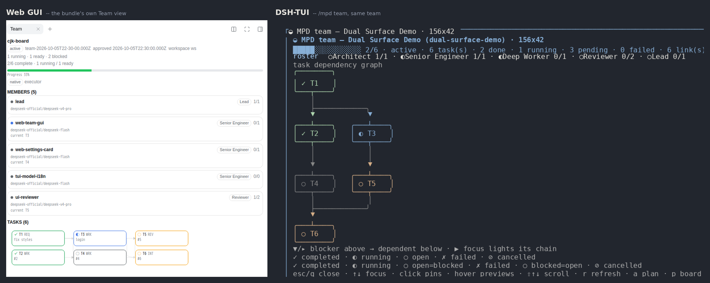
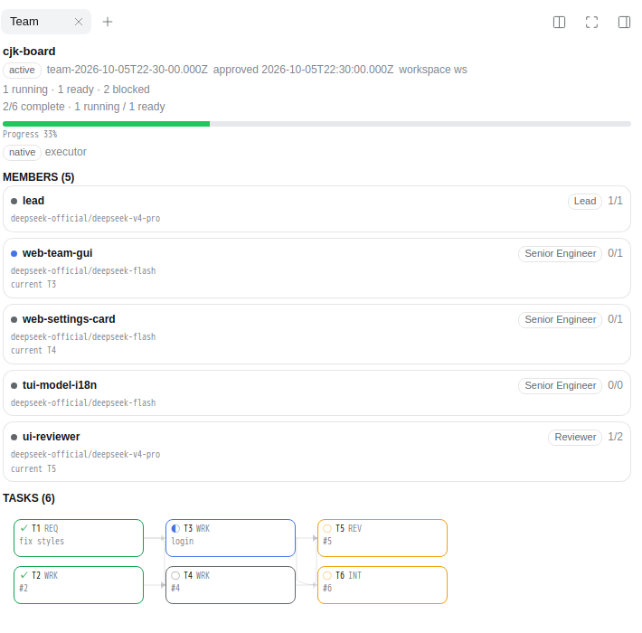
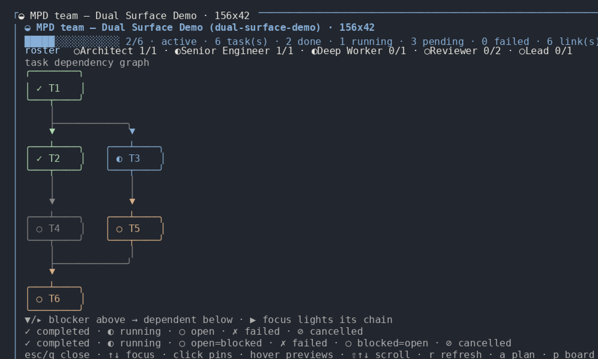
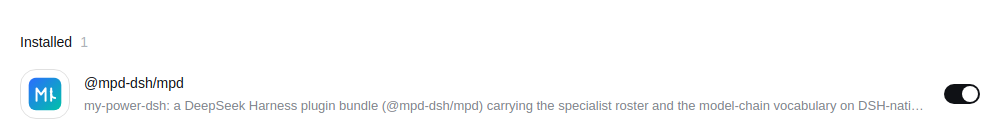
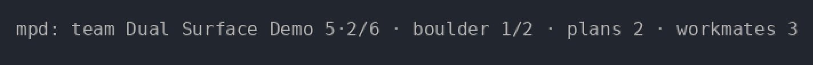
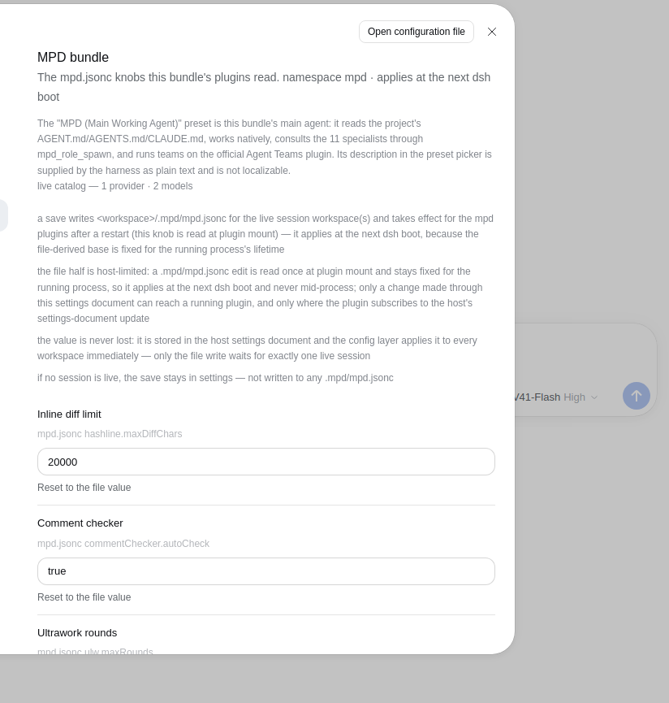
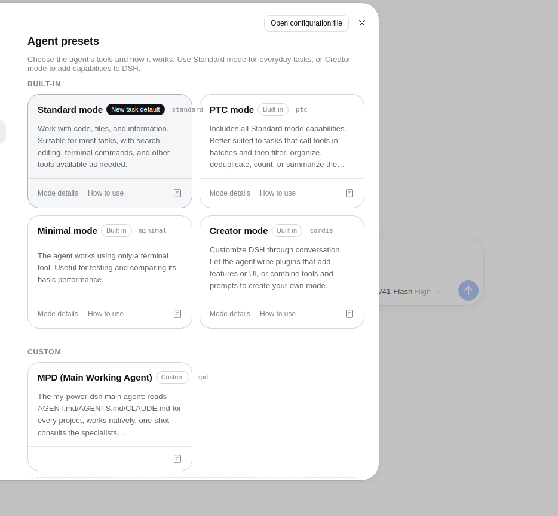
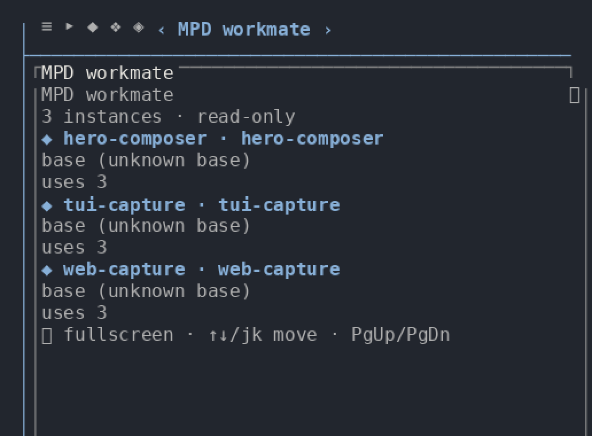

# my-power-dsh

**English** | [中文](./README.zh-CN.md)

[](https://github.com/HaroldZ32/My-Power-Dsh/releases)
[](https://www.npmjs.com/package/@mpd-dsh/mpd)
[](./LICENSE.md)
[](#acknowledgements)
[](#one-plugin-two-surfaces)
[](https://bun.sh)
[](https://github.com/HaroldZ32/My-Power-Dsh/actions/workflows/gates.yml)
[](./docs/index.md)

**my-power-dsh** is a plugin bundle for the [DeepSeek Harness](https://github.com/deepseek-ai/deepseek-harness)
(DSH). One install turns a plain DSH setup into a working environment for real coding work: a main
agent that reads your project rules, eleven specialists you can consult or delegate to, a library of
durable "workmate" agents that remember what they learned, multi-agent teams on the harness's own
Agent Teams plugin, a served skill corpus, MCP servers for code intelligence, and an extension
interface other packages can contribute to.

**It is one product on two surfaces.** Everything below exists in the **DSH Web GUI** *and* in the
**DSH-TUI** terminal edition — same install, same `.mpd/` state, same tools, same `mpd` preset.
Nothing is forked, and a capability is not missing from the terminal merely because it has no pixels
there.

The bundle is the package [`@mpd-dsh/mpd`](https://www.npmjs.com/package/@mpd-dsh/mpd); this
repository root *is* that package. It installs with one command and uninstalls with one command that
leaves no residue.



*The same bundle, the same run, the same state — the **Web GUI** on the left, the **DSH-TUI**
terminal edition on the right. Every screenshot here is a real capture of the shipped bundle, produced
by the Docker lanes under [`docker/ui/`](./docker/ui/): the Web tiles by headless Chromium driving the
real app, the terminal tiles by rasterizing the **bytes the real TUI emitted on a real PTY**
(`tmux capture-pane -e`, carrying the TUI's own colours) at the grid tmux computed.
The TUI localizes its command descriptions and its status line but **not** its scene bodies, so the
terminal scene tiles read the same in both languages.*

## One plugin, two surfaces

One install puts the bundle into either profile — or both — and the two surfaces share one state root
(`<workspace>/.mpd/`), one set of tools and one `mpd` preset. Only the *rendering* differs.

| What you want to do | DSH Web GUI | DSH-TUI (terminal) | Parity |
|---|---|---|---|
| See the team: id, name, phase, status | the **Team** view in a sidebar, served by this bundle (`/plugins/mpd-team/state`) | `/mpd team` — a full-screen scene | same facts |
| Read the roster: members, model routes, per-member task counts | the Team view's member cards | the same rows inside `/mpd team` | same facts |
| Read the task graph — id, kind, status, owner, attempt, round, dependencies | the Team view's dependency graph; hover lights a chain, click pins a node | the same rows as boxes and box-drawing edges | same facts |
| Watch a wave that has gone quiet | the **Team watchdog** sidebar tab: the hold, the escalation banner and the incident replay | the `team-hold held (…)` row plus the incident replay dialog | same facts |
| Review a staged plan before any work starts | the Team view renders the staged plan and the phrase that approves it | `/mpd plan` — read it, type `approve plan-…`, then `Ctrl+X` | the same plan; approving is an `agent_teams_plan` tool call on both |
| Browse the workmate library | the **Workmates** sidebar tab: listing, persona / memory / note | `/mpd workmates` — the listing only | TUI is **listing-only**; mutations are Web-only |
| Tune the bundle's knobs | Settings → **MPD** section | `/settings` → the MPD section | same knobs, same restart caveat |
| See plan / boulder / workmate progress while you type | the sidebar and the settings card | the keyed **status line** above the prompt | TUI-native surface |
| Stay on the keyboard | — (pointer, plus the panel below) | the **status line**, the `/mpd` command tree, the `alt+a` merged panel | TUI-native surface |
| See the roster and board the *harness* ships | the **Agent Teams** panel in the conversation header — a **different, read-only** surface (it spawns, renames and deletes nothing) | — | not this bundle's surface |
| Look at an archived team | `?archived=1` on the Agent Teams panel | not projected — the TUI reads the newest live record | Web-only |
| Drag and resize the panel | the Agent Teams panel is a floating panel | a terminal scene has no geometry | not applicable |

Two Web surfaces are easy to confuse, so the table names them apart: the **Agent Teams** panel in the
conversation header is the harness's own client and is read-only, while the **Team** and
**Team watchdog** views are this bundle's own pages, served from its routes and rendered in whichever
sidebar host the composition provides.

**Parity is measured here, not asserted.** [`docs/tui-parity.md`](./docs/tui-parity.md) is the
row-by-row ledger behind this table — every row names its evidence, and every deviation that is still
open is recorded there. The rows above whose two columns are not the same sentence are exactly those
recorded deviations. Read the ledger before you rely on the TUI for a Web capability.





## Features

- **A main agent that reads your rules** — the bundle's one preset, `mpd`, carries the
  project-instruction convention: every session attempts `AGENT.md`, then `AGENTS.md`, then
  `CLAUDE.md`, from the project root down to the working directory.
- **Eleven specialists, consulted or delegated** — Architect, Researcher, Planner, Deep Worker,
  Senior Engineer, Lead, Explorer, Reviewer, Plan Reviewer, Vision Analyst, Junior Engineer. Each is
  a teammate template with its own model route, and the read-only ones are denied write tools
  *mechanically* rather than by convention.
- **A workmate library that accumulates** — instantiate a specialist as a durable agent under
  `~/.mpd/workmate/`; it self-summarizes after each session, evolving its own persona and memory.
- **Real multi-agent teams** — the harness's official Agent Teams plugin, driven by the `mpd` rows:
  `spawn_teammate`, a shared task board with a compare-and-set lifecycle, a durable mailbox, and a
  Web panel and a TUI scene that read the same live record.
- **A durable plan ledger** — ULW rounds with per-criterion PIN → RED → GREEN → SURFACE → CLEAN, a
  boulder ledger anchored to a plan file, and a persisted goal that survives across sessions.
- **Memory and edits that hold up** — a VCS-backed memory store with a reflection state machine, plus
  hash-anchored editing, a write guard and a declaration-comment gate.
- **Verification with teeth** — the code one agent writes is verified by a *different* agent, from a
  frozen contract, with a recorded verdict and gate evidence.
- **Code intelligence and extensibility** — MCP servers for AST search (ast-grep), a code knowledge
  graph, a language server and git-bash; plus an extension interface other packages contribute
  skills, flows, MCP servers and specialists through.
- **Bilingual by policy** — every human-facing document ships an English file and a 简体中文 twin; a
  gate reddens when one falls behind.

## Install

Requires **Node.js ≥ 22.18** and `pnpm` on `PATH`, and a **DSH** install with a `web` or `headless`
profile. The bundle never configures model keys for you.

```bash
# Web GUI profile
dsh plugin --profile web add @mpd-dsh/mpd

# DSH-TUI profile — the same bundle, the terminal surface
dsh plugin --profile dsh-tui add @mpd-dsh/mpd
```

Then restart `dsh` and start a session on the **MPD (Main Working Agent)** preset. To uninstall:

```bash
dsh plugin --profile web remove @mpd-dsh/mpd
```

The package declares no `cordis` dependency and no `preinstall`/`install`/`postinstall`/`prepare`
script, so installing it runs no code from the package. Its rows reach the harness only through
`cordis.patch.yml` and the profile mechanism, and it overrides **no** host row: the `mpd` preset is
added additively and becomes your default through *your* action, never the bundle's.



To track the repository instead of the npm release, or to pin a revision, install from a checkout:

```bash
git clone https://github.com/HaroldZ32/My-Power-Dsh.git && cd My-Power-Dsh
bun install                                       # materialize the declared runtime dependencies
dsh plugin --profile web add .
```

Full install detail — the packed artifact, the `dsh-tui` launcher, the dependency closure and what
the install mounts — is in the [user guide](./docs/user-guide.md#1-install).

## Quick start

1. **Install**, restart `dsh`, and start a session on the **MPD (Main Working Agent)** preset.
2. **Ask for something real.** The agent has `bash` / `read` / `edit` plus the MCP code tools. Drop an
   `AGENT.md` in your project to steer it — it is read automatically at session start.
3. **Consult a specialist.** `mpd_roles_list` shows the roster, then
   `mpd_role_spawn { role: "Architect", task: "review the module boundaries in src/" }`.
4. **Keep the good one.** `mpd_workmate_init { base: "Architect", name: "system-architect" }`, then
   reuse it with `mpd_workmate_spawn { name: "system-architect", task: "…" }`.
5. **Scale to a team.** Ask for one, or describe work that warrants one: the captain spawns each
   member with `spawn_teammate` and opens its lane with `team_task_create`, then drives it with
   `send_message` / `wait_agent`. Watch the roster and the shared board in the Web panel's **Agent
   Teams** view, or in the TUI's `/mpd team` scene.
6. **Teach it a capability.** Put an extension directory into `<workspace>/.mpd/extensions/` and check
   it with `mpd_ext_list`.

Two commands worth knowing from the first minute:

```text
/ulw  <objective>     drive a long objective to done, in rounds, with gates
/mpd  team            open the team scene (DSH-TUI)
```

Or just ask. Reach for a specialist when you want a scoped second pair of eyes:

```text
use the Architect to review the retry logic in src/queue.ts
```



The status line, the `/mpd` command tree and the `/settings` section are terminal-native surfaces;
their Web counterparts are the Agent Teams panel, the Workmates tab and Settings → MPD.

## Usage

The bundle's work happens through tools and commands — the same ones on both surfaces. The short
version:

| You want to… | Reach for | Detail |
|---|---|---|
| Work with an agent that knows your project rules | the **`mpd` preset** | [user guide §2](./docs/user-guide.md#2-the-mpd-preset) |
| Get a scoped second opinion | the **specialist roster** — `mpd_role_spawn` | [user guide §4](./docs/user-guide.md#4-specialists-the-roster) |
| Keep a specialist that accumulates knowledge | the **workmate library** — `mpd_workmate_*` | [user guide §5](./docs/user-guide.md#5-workmate-library-durable-evolving-specialists) |
| Run a real multi-agent workflow | **team mode** — `spawn_teammate` + `team_task_*` | [user guide §6](./docs/user-guide.md#6-team-mode) |
| Drive a long objective to done | the **ULW loop** — `/ulw` | [user guide §13.2](./docs/user-guide.md#132-the-ulw-loop-and-its-gates) |
| Track a multi-step plan durably | the **boulder ledger** — `mpd_boulder_*` | [user guide §13.6](./docs/user-guide.md#136-the-boulder-ledger) |
| Remember facts across sessions | the **memory engine** — `mpd_memory_*` | [user guide §13.7](./docs/user-guide.md#137-memory) |
| Edit files without line-drift mistakes | **hash-anchored editing** — `mpd_hashline_*` | [user guide §13.5](./docs/user-guide.md#135-hash-anchored-edits) |
| Understand an unfamiliar codebase | the **MCP servers** — ast-grep, LSP, CodeGraph | [user guide §3](./docs/user-guide.md#3-tools-by-job) |
| Teach the bundle a new trick | the **extension interface** — `mpd_ext_*` | [user guide §10](./docs/user-guide.md#10-extensions-from-your-side) |
| Drive it all from a terminal | the **DSH-TUI edition** | [user guide §7](./docs/user-guide.md#7-dsh-tui-edition-the-terminal-ui) |





Configuration is JSONC and layered — `<workspace>/.mpd/mpd.jsonc` over `$DSH_HOME/mpd.jsonc`, per
key, project wins. Your state lives in `<workspace>/.mpd/`; the one exception is the workmate
library, which is HOME-scoped at `~/.mpd/workmate/`. See
[user guide §9](./docs/user-guide.md#9-configuration-mpdjsonc) and
[§14](./docs/user-guide.md#14-where-these-capabilities-come-from).



## Status and known limitations

- **Built and verified against a prerelease harness.** The bundle is tested against **0.2.0-rc.2**.
  Expect breakage while upstream stabilizes, and pin the harness version you use.
- **The TUI surface trails the Web surface in named places, not everywhere.** The rows of the table
  above that do not read "same facts" are open deviations, each recorded with its evidence in
  [`docs/tui-parity.md`](./docs/tui-parity.md). Nothing there is a surprise and nothing there is
  silently missing.
- **The bundle is a package, not a fork.** It ships no harness change and edits no DSH source; if the
  harness renames a seam, this bundle absorbs it in one adapter file.
- **A preset default is yours to choose.** The bundle overrides no host row, so `mpd` becomes the
  default only through your own action — [docs/preset-default.md](./docs/preset-default.md).
- **A saved setting takes effect after a restart.** The plugins capture their configuration when they
  mount, so `mpd_config_get` proving a new value is *not* proof that the running plugin acts on it.
- **The screenshots are headless captures.** Web tiles are Chromium at a fixed viewport, driven by
  Playwright; terminal tiles are the TUI's own ANSI byte stream rasterized at tmux's character grid.
  A different browser size or terminal will lay out differently: the *facts on screen* are the claim,
  not the pixels.
- **License: source-available, not open-source.** SUL-1.0 permits internal and personal use and free
  non-commercial distribution; it is not an OSI license.

## Documentation

- **[User guide](./docs/user-guide.md)** — install, tools by job, teams, recipes, command reference.
- **[Documentation hub](./docs/index.md)** — every document, with reading paths for users, extension
  authors, contributors and agents.
- **[DSH-TUI edition](./docs/tui.md)** — admission, distribution and per-package compatibility.
- **[TUI parity ledger](./docs/tui-parity.md)** — the Web surface against the TUI surface, row by row.
- **[Design](./docs/design.md)** — how the bundle is assembled inside.
- **[Extensions](./docs/extensions.md)** and the
  **[extension authoring guide](./docs/extension-authoring-guide.md)**.
- **[Contributing](./CONTRIBUTING.md)** — setup, the gates and the git model.

## Contributing

[`CONTRIBUTING.md`](./CONTRIBUTING.md) carries the setup, the build and gate commands, and the branch
model. This repository is developed against a gate suite rather than a review convention: a change
without evidence on disk is not done. Both the human-facing docs and the pull-request description are
bilingual (English and 简体中文).

## Changelog

Release notes live in [`CHANGELOG.md`](./CHANGELOG.md), newest first, one section per released
version (the current release is **v0.12.0**). Annotated tags are listed under
[Releases](https://github.com/HaroldZ32/My-Power-Dsh/releases).

## Acknowledgements

The specialist roster, the model-chain vocabulary and the roster's stable ids are adapted from
[`code-yeongyu/oh-my-openagent`](https://github.com/code-yeongyu/oh-my-openagent) (v5.0.0-beta.20),
recorded as historical provenance in [`VENDOR_LOCK.json`](./VENDOR_LOCK.json) — a *reference, not a
dependency*: nothing here reads, copies, patches or audits it, and no gate fails when it is
unreachable.

The bundle composes over the harness's own official packages rather than forking them, and mounts the
community sidebar bundle `dsh-better-sidebar` for the Workmates tab. Attribution and third-party
notices are in [`LICENSE-NOTICES.md`](./LICENSE-NOTICES.md).

## License

**SUL-1.0** — see [`LICENSE.md`](./LICENSE.md). Internal and personal use; distribution is free and
non-commercial only.
