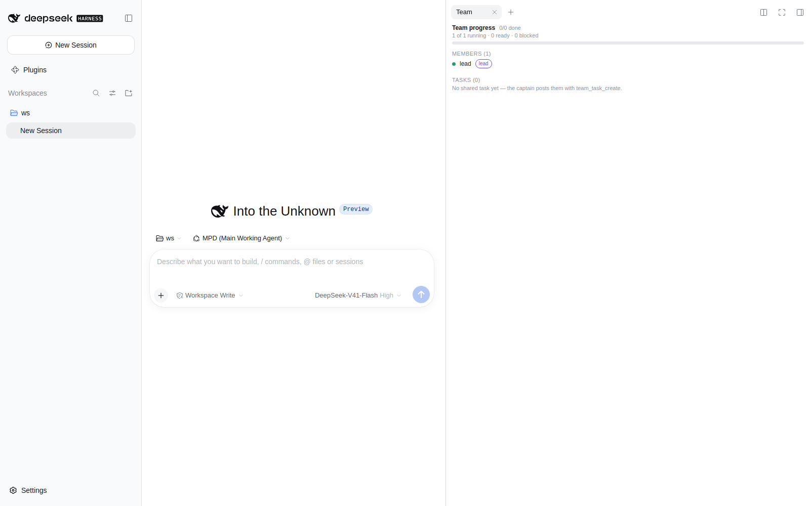
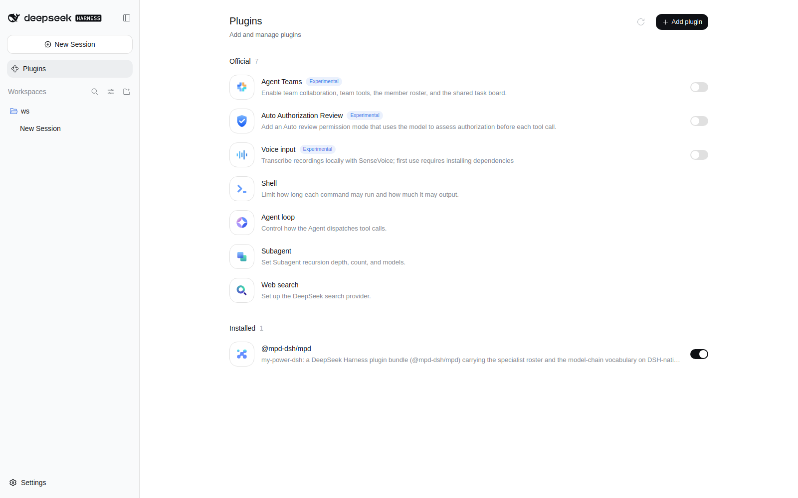
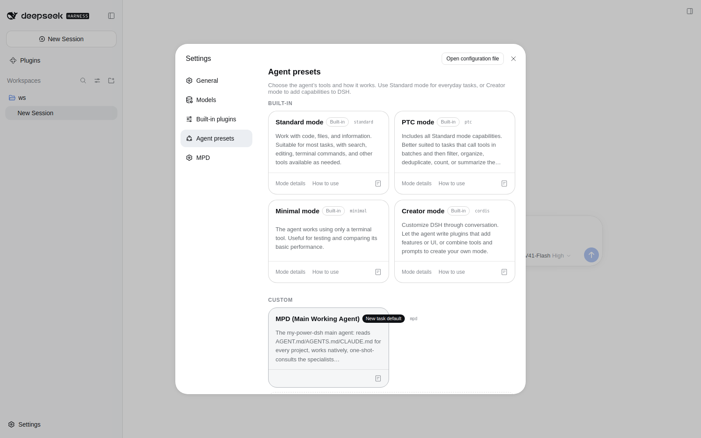
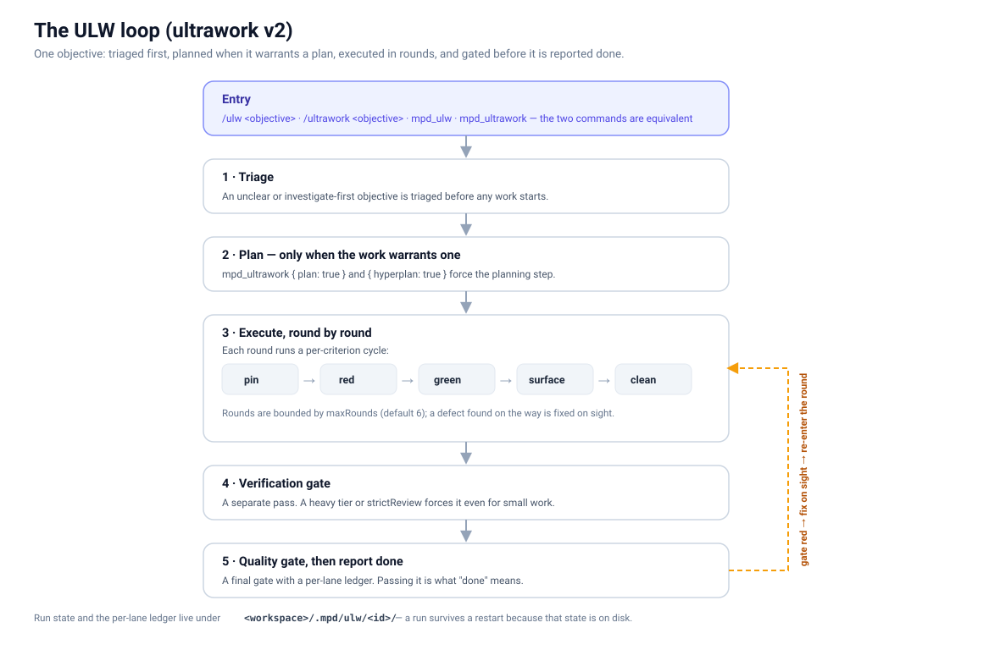
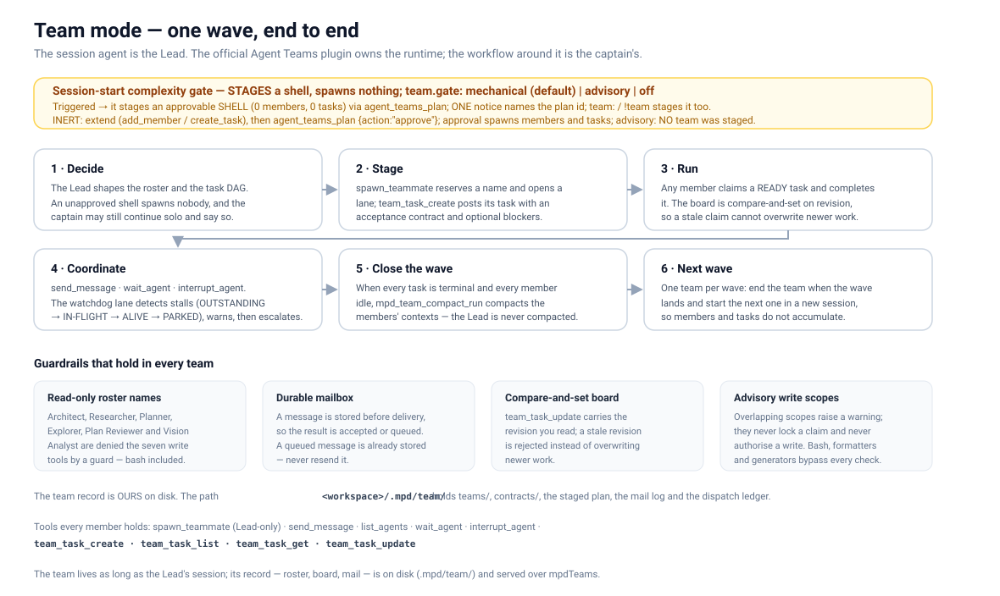
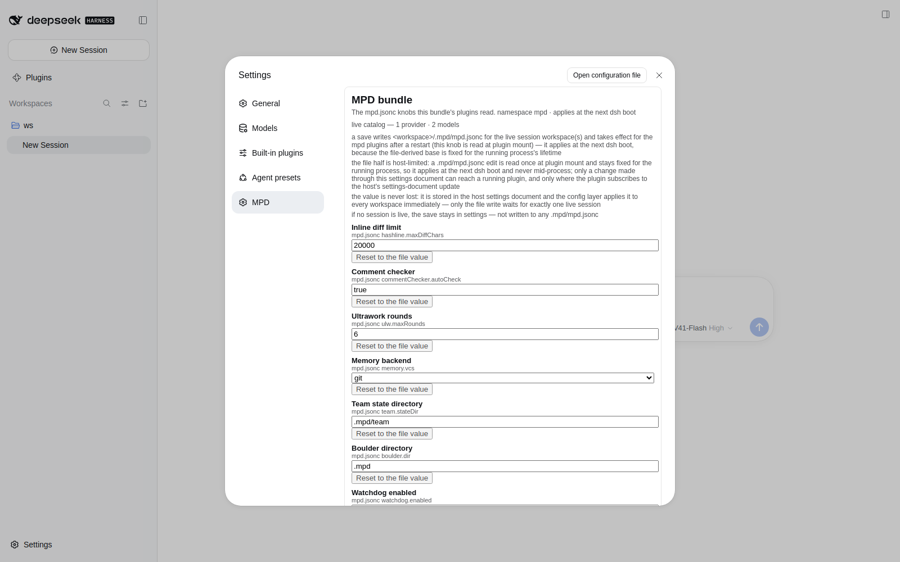
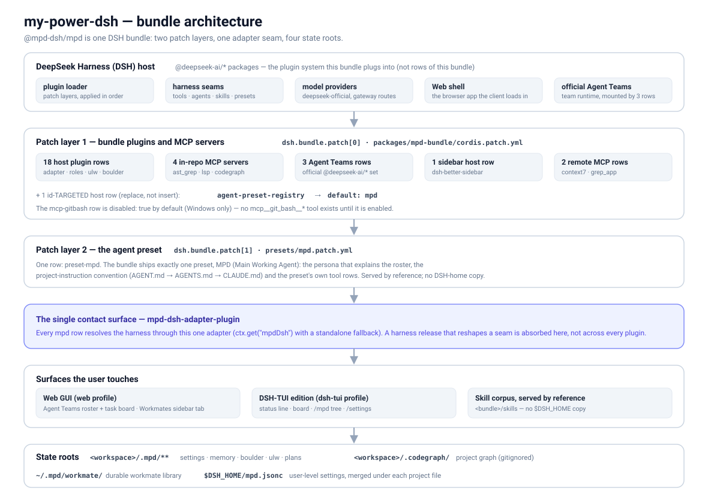

# my-power-dsh

[English](./README.md) | **中文**

[](https://github.com/HaroldZ32/My-Power-Dsh/releases)
[](./LICENSE.md)
[](#鸣谢)
[](./docs/tui.zh-CN.md)
[](https://bun.sh)
[](https://github.com/HaroldZ32/My-Power-Dsh/actions/workflows/gates.yml)
[](./docs/index.zh-CN.md)

**my-power-dsh** 是 **DeepSeek Harness（DSH）** 的插件 bundle。一次安装，就能把一套朴素的 DSH
环境变成真正可用于工程开发的工作环境：一个会自动读取你项目规则的主智能体、十一位可供咨询或委派的
专家、一个会记住自己所学内容的持久化 workmate 智能体库、跑在 harness 官方 Agent Teams 插件上的
多智能体团队、一套随包提供的 skill 语料库、用于代码理解的 MCP 集成，以及一套扩展接口 —— 让其他包
在不改动核心的前提下贡献 skill、flow、MCP 服务器与专家。

本文是它的**使用手册**：怎么安装、该敲什么、每条命令与每个工具做什么、怎么配置、你的数据放在哪里。
内部实现（启动链、包的构成、插件机制）只写在一处，本文用 *架构* 一节指过去。

这个 bundle 就是包 `@mpd-dsh/mpd`，而本仓库根目录**就是**这个包。它用一条命令安装，也用一条命令
卸载，不留残留。



*DSH Web 界面中的 **MPD（Main Working Agent）** preset，会话旁边是打开着的 Agent Teams 名册与共享任务板。本手册中的每张截图都是随包发布 bundle 的真实截图，由 Docker UI 通道从运行中的应用里截取（`docker/ui/`）。*

## 目录

- [特性](#特性)
- [环境要求](#环境要求)
- [安装](#安装)
- [快速上手](#快速上手)
- [主智能体与你的项目规则](#主智能体与你的项目规则)
- [命令](#命令)
- [用法](#用法)
- [专家名册](#专家名册)
- [团队模式](#团队模式)
- [Web GUI](#web-gui)
- [DSH-TUI 版本](#dsh-tui-版本)
- [配置](#配置)
- [你的状态存放在哪里](#你的状态存放在哪里)
- [架构](#架构)
- [常见问题](#常见问题)
- [文档](#文档)
- [贡献指南](#贡献指南)
- [变更日志](#变更日志)
- [鸣谢](#鸣谢)
- [许可证](#许可证)

## 特性

| 你想做的事 | 用什么 | 详细说明在哪 |
|---|---|---|
| 让智能体知道你的项目规则 | **`mpd` preset**（本 bundle 唯一随包提供的 preset） | *主智能体与你的项目规则* |
| 要一份第二意见，或一个范围明确的执行者 | **专家名册** —— `mpd_role_spawn` | *专家名册* |
| 养一个会不断积累知识的专家 | **workmate 库** —— `mpd_workmate_*` | *养一个会成长的智能体* |
| 跑一条真正的多智能体流水线 | **团队模式** —— 官方 Agent Teams 工具（`spawn_teammate`、`team_task_*`）+ Web 名册/任务面板 | *团队模式* |
| 把一个长期目标推到完成 | **ULW 循环** —— `/ulw` | *推进长任务：ULW 循环* |
| 持久地跟踪一份多步计划 | **boulder 账本** —— `mpd_boulder_*` | *跟踪计划进度：boulder 账本* |
| 跨会话记住事实 | **记忆引擎** —— `mpd_memory_*` | *保存持久记忆* |
| 避免行号漂移导致的误改 | **哈希锚定编辑** —— `mpd_hashline_*` | *安全地编辑文件* |
| 快速看懂陌生代码库 | **MCP 服务器** —— ast-grep、LSP、CodeGraph | *理解代码库* |
| 让 bundle 学会一项新本事 | **扩展接口** —— `mpd_ext_*` | *配置与扩展* |
| 全部在终端里驱动 | **DSH-TUI 版本** | *DSH-TUI 版本* |

## 环境要求

- **DeepSeek Harness（DSH）**，使用 `web` 或 `headless` profile，并在 DSH 中配置好模型凭据 ——
  本 bundle 从不会替你配置密钥。本 bundle 是针对 harness **0.2.0-rc.2** 构建并验证的。
- **Node.js** 与 **Bun**（`1.4.0`，即 `package.json` 中 `buildToolchain` 字段记录的版本），需要在
  `PATH` 上，供仓库脚本使用（`bun` 用来跑测试与扩展 CLI）。
- **git**：源码安装需要它 —— 主要流程就是克隆本仓库并从检出目录安装。
- 可选项：若要使用代码智能相关服务器，可用 bundle 提供的工具链安装
  （`node scripts/install-mcp.ts`），也可以用自己的二进制文件，并通过文档中给出的环境变量指向它
  （`MPD_DSH_AST_GREP_SG_PATH`、`MPD_CODEGRAPH_BIN` 等）。

## 安装

### 一条命令，无需克隆（推荐）

本 bundle 就是一个普通包：profile 拉取它，按清单里的 `files` 白名单打包，再用它自带的
`cordis.patch.yml` 各层完成挂载。你的机器上不需要克隆，也不需要构建。

```bash
dsh plugin --profile web add github:HaroldZ32/My-Power-Dsh
```

随后重启 `dsh`，在会话里选择 **MPD（Main Working Agent）** preset：

```bash
dsh web            # 启动（或重启）web profile —— 等同于：dsh --profile web
```

前置条件：**Node.js ≥ 22.18**，并且 `pnpm` 在 `PATH` 上 —— `dsh plugin` 会把安装交给 pnpm，而本
bundle 直接依靠 Node 的类型擦除执行 TypeScript。包内**没有** `cordis` 依赖，也没有
`preinstall`/`install`/`postinstall`/`prepare` 脚本，因此安装过程不会执行包内的任何代码。

卸载：

```bash
dsh plugin --profile web remove @mpd-dsh/mpd
```

### 从检出目录开始

克隆是贡献者、需要固定版本、以及 DSH-TUI 版检出流程的路径。本节余下内容以检出为准；如果你装的是
已发布的包，命令完全一致。

```bash
git clone https://github.com/HaroldZ32/My-Power-Dsh.git
cd My-Power-Dsh
```

### 安装依赖

```bash
bun install
```

本 bundle 声明了四个运行时依赖 —— `dsh-better-sidebar`（承载 Workmates 标签页的社区侧边栏
bundle）以及提供团队模式的三个官方 Agent Teams 包（见 *这次安装挂载了哪些插件*）—— 因此检出目录
安装要先把仓库依赖落到本地。

如果 `node-gyp` 不可用，可以不带构建脚本安装该侧边栏 —— 只有侧边栏的终端面板会降级。早期版本需要
这么做，是因为它会拉入传递依赖 `node-pty`，其 postinstall 依赖 `node-gyp` 构建（也正是 pnpm 报
「被忽略的构建脚本」的那一个）；`dsh-better-sidebar@0.24.1` 已不再依赖 `node-pty`（2026-10-02 实测：
其 `dependencies` 中已无该项），因此该开关现在是双保险而不再必需：

```bash
bun add dsh-better-sidebar@0.24.1 --ignore-scripts
```

从打包产物安装时无需这一步（pnpm 会装好声明的依赖），见下方 *从打包产物安装*。

### 从源码构建

仓库中已提交的 `dist/` 文件就是构建产物，随仓库一起发布，所以普通安装不需要构建步骤。只重建你改动的
那个包，并且要**在仓库根目录**用带路径的完整参数执行：

```bash
bun build packages/<pkg>/src/index.ts --target node --format esm --outfile packages/<pkg>/dist/index.js
```

多入口的包对每个入口重复这条命令。`node scripts/verify-dist-fresh.ts` 会重建每一个
`packages/*/src` 入口并与已提交的 `dist/` 逐字节比较，所以源码改动与它的重建属于同一次提交。
另外两条最常用的命令是 `bun run typecheck`（根目录）与 `bun test packages`；完整关卡清单见
[`CONTRIBUTING.zh-CN.md`](./CONTRIBUTING.zh-CN.md)。

检出目录安装会直接读取该目录：改动代码后，重新构建所改包的 `dist/`，再重启 `dsh`。

### 把 bundle 安装进 DSH（web profile）

```bash
dsh plugin --profile web add .
```

仓库根目录就是 bundle 包本身，所以这一条命令会同时安装全部插件行、`mpd` preset、18 个 skill 的
语料库与扩展根目录 —— 不需要打包步骤，也不需要复制步骤。之后重启 `dsh`，在会话中选择
**MPD（Main Working Agent）** preset：

```bash
dsh web            # 启动（或重启）web profile —— 等同于 dsh --profile web
```

### 安装到终端界面（`dsh-tui` profile）

同一个 bundle 也能装进终端界面 profile：

```bash
dsh plugin --profile dsh-tui add .
```

安装后，本 bundle 成为该 profile 的**第三层 patch**，叠在 TUI 包之上：`dsh.profile.bundles`
变为 `["@deepseek-ai/dsh-base", "@deepseek-harness-tui/dsh-tui", "@mpd-dsh/mpd"]`，
`dsh --profile dsh-tui --dump-config` 会把我们的行显示在独立的一层里
（`# == @deepseek-harness-tui/dsh-tui, patched by @mpd-dsh/mpd`）。本 bundle **不覆盖任何宿主行**：
它以**插入**方式提供 **mpd** preset，并由你自己一步把它设为默认（TUI 里 `/preset mpd`、
`DSH_TUI_PRESET=mpd`、Web 端 Settings 的 `selectedDefault` 字段，或
`node scripts/set-default-preset.ts --yes`）—— 见 [docs/preset-default.zh-CN.md](./docs/preset-default.zh-CN.md)。
用 `dsh-tui` 启动器（别名 `dst`）启动：

```bash
dsh-tui            # 在当前目录启动
dsh-tui --resume   # 继续上一个会话（简写 -c）
dsh-tui doctor     # 检查 profile 与工具链
dsh-tui --help     # update | doctor | version | help；其余参数原样转发给 `dsh --profile dsh-tui`
```

`dsh-tui` 需要真实终端：如果输出被重定向到管道，它会拒绝启动并提示
`Error: dsh-tui requires an interactive terminal (stdout must be a TTY).`

### 从打包产物安装

如果要使用已发布包或 tarball，先组装出可迁移的 bundle，再把该产物加入你实际使用的那个 profile：

```bash
node scripts/pack-mpd.ts                       # -> dist/mpd-package/（可迁移）
dsh plugin --profile web add dist/mpd-package
dsh plugin --profile dsh-tui add dist/mpd-package
```

### 卸载

每条 `dsh plugin` 命令都必须带 `--profile` —— 不带时 CLI 会直接停下并提示
`error: required option '--profile <name>' not specified`：

```bash
dsh plugin --profile web remove @mpd-dsh/mpd
dsh plugin --profile dsh-tui remove @mpd-dsh/mpd
```

本 bundle 作为一个整体卸载，skills 也包含在内，并在你的 DSH home 中不留残留。留下来的都是你自己的
数据：workmate 库（`~/.mpd/workmate/`）与各工作区的 `.mpd/` 状态。

### 这次安装挂载了哪些插件

下面每一个插件都由本 bundle 的两个 patch 文件声明 —— `cordis.patch.yml`
（下面所有表格里的行）与 `presets/mpd.patch.yml`（`preset-mpd` 行，见
*本 bundle 不覆盖任何宿主行*）—— 并被上面那一条 `dsh plugin add` 一次性挂载。`package.json` 把
这两个文件列为数组 `dsh.bundle.patch`。主 patch 一共写了 **31 个 `- id:` 条目，而且每一个都位于
`insert:` 列表之内**（共五个 insert 列表）；它 id 定向的宿主行为 **0** 个。
`node scripts/verify-rows-parity.ts` 让这些行 id 与安装脚本保持一致，而
`node scripts/verify-no-host-override.ts` 会在任何宿主行被 id 定向的瞬间失败。

**Bundle 宿主插件 —— 18 个 insert 行**

| Row id | 包 | 提供的能力 |
|---|---|---|
| `mpd-web-compat` | `mpd-bundle-plugin` | 名为 `@mpd-dsh/mpd` 的 loader entry，让 bundle 的 web 客户端能被加载；同时也是合并后的 Web 界面（见 *Web GUI*） |
| `mpd-dsh-adapter` | `mpd-dsh-adapter-plugin` | 与 harness 的 tool/agent/skill/preset 接缝之间唯一的接触面；其他每一行都经由它调用 |
| `mpd-config` | `mpd-config-plugin` | `.mpd/mpd.jsonc` 配置层、`mpdConfig` 服务、`mpd_config_get` / `mpd_config_reload` |
| `mpd-team-watchdog` | `mpd-team-watchdog-plugin` | 团队通道的停滞检测：心跳尾部、事件记录、保留式 hold |
| `mpd-tools` | `mpd-tools-plugin` | 内置文件工具的写入守卫、输出截断与编辑失败恢复提示 |
| `mpd-modelchain` | `mpd-modelchain-plugin` | `mpd_modelchain_resolve`，以及 `mpd_memory_save` / `mpd_memory_recall` |
| `mpd-ext` | `mpd-ext-plugin` | 扩展接口：清单发现、四个检查工具、stdio MCP 桥、作者 CLI |
| `mpd-roles` | `mpd-roles-plugin` | 专家名册与 `mpd_roles_list` / `mpd_role_spawn` / `mpd_role_persona` |
| `mpd-ulw` | `mpd-ulw-plugin` | ultrawork 循环：`mpd_ultrawork` / `mpd_ulw` 与 `/ulw`、`/ultrawork` 命令 |
| `mpd-hashline` | `mpd-hashline-plugin` | 哈希锚定编辑纪律：`mpd_hashline_read/edit/format/restore` |
| `mpd-boulder` | `mpd-boulder-plugin` | 持久化工作账本：基于 `.mpd/boulder.json` 与 `.mpd/plans/` 的 `mpd_boulder_*` |
| `mpd-comment-checker` | `mpd-comment-checker-plugin` | 基于可选 comment-checker 二进制的 `mpd_comment_check` |
| `mpd-codegraph` | `mpd-codegraph-plugin` | 二进制解析、项目索引初始化与 `/mpd-codegraph` 命令 |
| `mpd-memory` | `mpd-memory-plugin` | git/svn 后端记忆库及其反思（reflection）状态机 |
| `mpd-workmate` | `mpd-workmate-plugin` | `~/.mpd/workmate/` 下的持久 workmate 库（`mpd_workmate_*`） |
| `mpd-team-compact` | `mpd-team-compact-plugin` | 对已结束团队的成员上下文做压缩（`mpd_team_compact_run/status`） |
| `mpd-bootstrap` | `mpd-bootstrap-plugin` | 通过 harness 的 skill 接缝提供 bundle 的 skill 语料库（`<bundle>/skills` 树）；清理旧版遗留在 home 的副本 |
| `mpd-tui` | `mpd-tui-plugin` | DSH-TUI 界面：状态行、看板、`/mpd` 命令树、受管对话框、快捷键、`/settings` |

`mpd-tui` 在**每一个** profile 中都会被组合，而不只是 `dsh-tui`：在 web 或 headless 组合里，它的界面
只是降级（每缺一个 TUI 接缝就警告一次），并不会把启动拖垮。

**仓库内的 MCP 服务器 —— 4 个 insert 行**（stdio，从本仓库启动）

| Row id | 服务器名 | 提供的能力 |
|---|---|---|
| `mcp-astgrep` | `ast_grep` | 基于 AST 的检索、重写与 YAML 规则扫描（`mcp__ast_grep__*`） |
| `mcp-gitbash` | `git_bash` | Git-for-Windows shell 桥 —— **默认 `disabled: true`**（仅 Windows）；把该行改成 `disabled: false` 才会启用，在那之前不存在 `mcp__git_bash__*` 工具 |
| `mcp-lsp` | `lsp` | 语言服务器智能：诊断、跳转定义、引用查找、重命名（`mcp__lsp__*`） |
| `mcp-codegraph` | `codegraph` | 项目结构化代码图探索（`mcp__codegraph__*`） |

**官方 Agent Teams 行 —— 3 个 insert 行**

本 bundle 的团队能力来自**官方** DSH Agent Teams 插件组（不是内置的引擎）：这三个包声明在
`package.json` 的 `dependencies` 中，并由下面的行挂载（*鸣谢* 记录了为什么被淘汰的内置副本仍留在
仓库里）。

| Row id | 包 | 提供的能力 |
|---|---|---|
| `mpd-agent-team` | `@deepseek-ai/dsh-experimental-agent-team` | `ctx.agentTeams` 团队服务：隐式根名册、持久点对点邮箱与共享任务板。名册、邮箱与任务状态都持久化在 **Lead 的会话日志**里 |
| `mpd-tool-agent-team` | `@deepseek-ai/dsh-experimental-tool-agent-team` | 九个面向模型的工具 —— `spawn_teammate`、`send_message`、`list_agents`、`wait_agent`、`interrupt_agent`、`team_task_create` / `team_task_list` / `team_task_get` / `team_task_update` —— 以及每位成员都会收到的 `team:policy` 提示词小节 |
| `mpd-ui-agent-team` | `@deepseek-ai/dsh-experimental-client-ui-agent-team` | 会话头部里的 Web 名册、共享任务板与队友导航面板（只读：没有创建、改名、删除或中断控件，也没有任务修改控件） |

这些 entry id 有意用 `mpd` 前缀：官方 `@deepseek-ai/dsh-experimental-agent-team-profile` bundle
用 `agent-team` / `tool-agent-team` / `ui-agent-team` 三个 id 挂载同一批包，而重复的 loader entry
id 即使有一侧被禁用也是致命错误。与那个 profile bundle 不同，本 bundle 同时保留直接委派行
（`subagent`、`subagent_fork`），因此一个会话既有一次性 subagent 通道，也有持久的团队通道。

**侧边栏宿主 —— 1 个 insert 行**

承载 Workmates 标签页的社区侧边栏 bundle 是本 bundle 的**已声明运行时依赖**
（`package.json` 的 `dependencies`，即 `dsh-better-sidebar`），而不是需要用户手动安装的可选附加项：
下面这一行负责挂载它，因此一条安装命令就够了。

| Row id | 包 | 提供的能力 |
|---|---|---|
| `mpd-better-sidebar` | `dsh-better-sidebar` | 承载 mpd 两个标签页的侧边栏宿主（见 *Web GUI*）。它**只挂载一次**：只要任何被组合的 patch 层已经挂载该包 —— 每个已声明 bundle 层自身的 `dsh.bundle.patch`（例如 `@linxin666/dsh-web-all` 聚合包）、profile 的 `cordis.patch.yml`、`$DSH_HOME/cordis.patch.yml`，或从命令行读到的 `--patch` 覆盖层路径（`--patch X` 与 `--patch=X` 两种写法）—— 或者组合中不存在**已启用**的 `@deepseek-ai/dsh-host-webserver` 条目（`dsh-tui` / headless profile），或者该包无法解析时，这一行就会自行禁用。外部层只有在其 patch 里含有**真正挂载该包的行**时才会抑制本行 —— 即某行的 `name` 为 `dsh-better-sidebar` 且其 `disabled` 不是字面量 `true`；注释里的提及、或字面量 `disabled: true` 的行都不挂载任何东西，因此不会抑制我们的挂载。行扫描器无法解析的形式一律回退到保守行为（视作挂载）—— 误禁只损失侧边栏，误启用会让启动以 `duplicate prefix route` 直接失败。会话随后只打印一行日志并降级为"没有侧边栏"，而不是启动失败 |

**远程 MCP 行 —— 2 个 insert 行**（公开服务：需要网络，按需选用）

| Row id | 服务器名 | 提供的能力 |
|---|---|---|
| `mcp-context7` | `context7` | 公开的 Context7 文档服务，走 streamable HTTP（`https://mcp.context7.com/mcp`） |
| `mcp-grepapp` | `grep_app` | 公开的 grep.app GitHub 代码检索服务，走 streamable HTTP（`https://mcp.grep.app`） |

**本 bundle 不覆盖任何宿主行 —— 这一 patch 是纯增量的**

本 bundle 发布的每一行都是**以自己的 entry id 插入**（`insert:`）；它绝不会 id 定向（id-target）
任何宿主层（`dsh-base`、`dsh-web-app`、`dsh-headless`、`dsh-tui`）声明的行。门禁
`node scripts/verify-no-host-override.ts` 会在这一点被破坏时失败，而且当它一个宿主层都找不到时**拒
绝**给出空洞的通过。

部署默认 preset 是**宿主自己的**设置（宿主 `@deepseek-ai/dsh-agent-preset-registry` 行的 `default`
键），所以本 bundle 不碰它：它只以插入方式提供 `mpd` preset，把选择权留给你 —— TUI 里 `/preset mpd`
（写入 `~/.dsh-tui/agent-preset.json`）、在你自己的 profile patch 里设 `DSH_TUI_PRESET=mpd`、Web 端
Settings 的 `selectedDefault` 字段，或 `node scripts/set-default-preset.ts --yes`。**已有用户**会发生
什么变化，见 [docs/preset-default.zh-CN.md](./docs/preset-default.zh-CN.md)：在你自己执行上面任一步以
前，默认值不再是 `mpd`，而 `dsh-tui` 配置会回退到宿主默认的 `standard`（该组合并不提供这个预设行）。

`mpd` preset 本身 —— 它的人设、项目指令约定、它的工具行 —— 由本 bundle 的**第二个** patch 文件
`presets/mpd.patch.yml` 以**行**（而不是目录）的形式声明：插入一行 `preset-mpd`，其
`name: '@deepseek-ai/dsh-agent-preset'`、`config.id: mpd`，整个子 entry 列表内联在
`config.plugins` 下。harness **0.1.7-rc.2 替换了目录形式**：`@deepseek-ai/dsh-agent-presets`
（那个从 preset 根目录提供 `preset.yml` + `agent.cordis.yml` 的包）已不存在，不再有
`<bundle>/presets` preset 根目录，也不再有 `$DSH_HOME/.agent-presets` 副本，而 `package.json` 的
`dsh.bundle.patch` 就是上面那两个文件组成的数组。

harness 自己的包（`@deepseek-ai/*`）属于 DSH 的依赖，而不是本 bundle 的依赖，所以它们不在这里的行
清单中 —— 它们的致谢写在 *鸣谢* 一节。

**可选工具链依赖**（声明在 `package.json` 的 `optionalDependencies` 中；如果你用自己的二进制并通过
环境变量指过去，对应的 MCP 行与工具在没有它们时也能工作）：

| 依赖 | 版本 | 用在哪 |
|---|---|---|
| `@ast-grep/cli` | `0.45.2` | `mcp-astgrep`（`mcp__ast_grep__*` 工具） |
| `@colbymchenry/codegraph` | `1.5.0` | `mcp-codegraph` 与 `mpd-codegraph` 行 |
| `@code-yeongyu/comment-checker` | `0.8.0` | `mpd_comment_check` |



*一条安装命令之后，用户看到的样子：Plugins 页面把 `@mpd-dsh/mpd` 列在 **Installed** 分区、开关已打开 —— 整个 bundle 就是这一个包。*

## 快速上手

1. **安装**（见上），重启 `dsh`，在 **MPD** preset 上开启一个会话。
2. **让它做一件真事。** 智能体具备 `bash`/`read`/`edit` 以及 MCP 代码工具。在项目里放一个
   `AGENT.md` 来引导它；会话开始时会被自动读取。
3. **咨询一位专家。** 先用 `mpd_roles_list` 看名册，然后
   `mpd_role_spawn { role: "Architect", task: "review the module boundaries in src/" }`。
4. **把好用的留下来。** `mpd_workmate_init { base: "Architect", name: "system-architect" }`，
   之后用 `mpd_workmate_spawn { name: "system-architect", task: "…" }` 复用它。
5. **扩展成一个团队。** 直接要一个团队，或者描述一件值得组队的工作：captain 用 `spawn_teammate`
   （名字、描述、初始提示词）逐个创建成员，用 `team_task_create` 给每人开一条任务，再用
   `send_message` / `wait_agent` 驱动。在 Web 面板的 **Agent Teams** 视图（会话头部）里看名册与
   共享任务板。
6. **接入你自己的能力。** 把一个扩展目录放进 `<工作区>/.mpd/extensions/`，再用 `mpd_ext_list`
   查看它。


*Web 界面里的第 1 步：新会话的输入框已经处于 **MPD（Main Working Agent）** preset，旁边是模型路线与权限模式。*

## 主智能体与你的项目规则

本 bundle 只随包提供一个 preset：**MPD（Main Working Agent）**。在会话中选中它，你会得到：

- **自动加载项目规则** —— 每次会话开始时，智能体会尝试读取 `AGENT.md`，回退到 `AGENTS.md`，
  再回退到 `CLAUDE.md`。这个文件写一次，之后每个会话一开始就知道你的约定。
- **harness 自带工具 + 本 bundle 的工具** —— `bash`、`read`、`edit`、`glob`、`grep` 等原生工具
  直接暴露；本 bundle 新增的一切（`mpd_*`、官方的 `spawn_teammate` / `team_task_*` 团队工具、
  MCP 服务器）就排在它们旁边。
- **内建路由** —— preset 的人设解释了专家名册、workmate 库与团队模式，因此智能体无需额外配置
  就知道该找谁。



*设置里的 **Agent presets** 页：本 bundle 的 `mpd` preset 就是那个带 **New task default** 标记的自定义项，因此新会话无需挑选就会用它。*

你不必为每件事重选 preset：同一个会话保持它自己的 preset，下面每一项能力在其中都可以直接用。

## 命令

斜杠命令直接敲在会话输入框里。

| 命令 | 会发生什么 |
|---|---|
| `/ulw <目标>` | 启动一次 ultrawork 运行：先对目标做分诊，在需要计划时先立计划，然后按轮次执行，并在报告完成前通过验证关卡与质量关卡。`/ultrawork <目标>` 是同一条命令 |
| `/mpd-codegraph` | 为当前会话工作区初始化（或重跑）CodeGraph 索引 —— `.codegraph/codegraph.db`。codegraph 二进制不可用时报错：装上它，或设置 `MPD_DSH_CODEGRAPH_BIN` |
| 消息里的 `team:` / `!team` | 一次显式的组队请求。会话起点的复杂度门只会**建议**，不会替你组建任何团队；智能体自己用 `spawn_teammate` + `team_task_create` 组队 |
| `/mpd`（TUI） | 终端命令树：只敲 `/mpd` 打开选择器；动作有 `board`、`team`、`plan`、`workmates`、`status`（`/mpd status` 打印摘要，其余打开各自的 TUI 界面） |
| `/goal <目标>` | 创建一个持久的会话目标（宿主的目标行，由 `mpd` preset 启用）：一个会跨轮次持续推进的长期目标 |
| `/settings`（TUI） | 编辑下面 *配置* 一节列出的 `mpd.jsonc` 旋钮 |

## 用法

这里只是索引；下面每一小节给出可直接照抄的调用。

| 你想做的事 | 工具 |
|---|---|
| 理解代码库 | `mcp__ast_grep__*`、`mcp__lsp__*`、`mcp__codegraph__*`、`mcp__context7__*`、`mcp__grep_app__*`（`mcp__git_bash__*` 有对应的行，但**默认关闭**且仅 Windows —— 不启用就不会暴露该工具） |
| 安全地修改 | 写入守卫与输出截断行、`mpd_hashline_read/edit/format/restore`、`mpd_comment_check` |
| 推进长任务 | `mpd_ulw` / `mpd_ultrawork`、`mpd_boulder_*` |
| 保存记忆 | `mpd_memory_write/read/reflect/reflect_complete/status`、`mpd_memory_save/recall` |
| 咨询专家 | `mpd_roles_list`、`mpd_role_spawn`、`mpd_role_persona`、`mpd_modelchain_resolve` |
| 养一个会成长的智能体 | `mpd_workmate_list/init/spawn/reflect/match/rename/delete` |
| 运行一个团队 | `spawn_teammate`、`send_message`、`list_agents`、`wait_agent`、`interrupt_agent`、`team_task_create/list/get/update`、`mpd_team_compact_run/status`、`session-watchdog-*` |
| 配置本 bundle | `.mpd/mpd.jsonc`、`mpd_config_get`、`mpd_config_reload` |
| 扩展本 bundle | `mpd_ext_list`、`mpd_ext_show`、`mpd_flow_list`、`mpd_flow_show` 以及 `extensions/` 根目录 |

### 理解代码库（MCP 服务器）

```jsonc
// 结构化检索 —— 按语法形状，而不是按文本
mcp__ast_grep__search { "pattern": "useEffect($$$)", "language": "tsx", "paths": ["src"] }
mcp__ast_grep__rewrite { "pattern": "console.log($A)", "rewrite": "logger.info($A)", "language": "typescript", "paths": ["src"], "apply": false }

// 语言服务器智能
mcp__lsp__diagnostics { "filePath": "packages/mpd-roles-plugin/src/index.ts" }
mcp__lsp__find_references { "filePath": "…/src/index.ts", "line": 42, "character": 9 }
mcp__lsp__rename { "filePath": "…", "line": 42, "character": 9, "newName": "resolvedConfig" }

// 项目代码图 —— 抛一个问题，拿回相关符号与调用路径
mcp__codegraph__codegraph_explore { "query": "how does a task get claimed and updated?" }

// 远程服务器：库文档与 GitHub 代码检索
mcp__context7__resolve-library-id { "libraryName": "zod", "query": "schema parsing" }
mcp__grep_app__searchGitHub { "query": "registerTool({", "language": ["TypeScript"] }
```

`mcp__lsp__rename` 与 `mcp__ast_grep__rewrite` / `mcp__ast_grep__scan` 会**写文件**：先用
`apply: false` 跑一遍，看清 diff，再真正应用。`mcp__git_bash__*` 默认是关闭的（仅 Windows）。
两个远程行（`context7`、`grep_app`）是公开 HTTP 服务，需要网络。

### 安全地编辑文件（哈希锚定 + 守卫）

`mpd-tools` 行给内置写入工具加了守卫：对已存在文件做内容会变化的 `write` 会被拒绝；过大的工具输出
会被截断并给出提示，而不是把上下文淹没。

对于会被反复编辑的文件，哈希锚定纪律消除了行号漂移：

```jsonc
mpd_hashline_read { "path": "src/config.ts" }        // 返回 `LINE#HASH|内容` 锚点
mpd_hashline_edit {
  "path": "src/config.ts",
  "edits": [{ "op": "replace", "pos": "42#a1b2", "end": "44#c3d4", "lines": ["new line"] }]
}
mpd_hashline_format { "path": "src/config.ts" }      // 把该文件登记给守卫
mpd_hashline_restore { "path": "src/config.ts" }     // 取消登记
```

锚点会针对当前文件校验：文件已经变化时，编辑会被拒绝并给出重映射后的引用，而不是落到错误的位置。
文件一经登记，若普通 `edit`/`write` 改动了它，守卫会发出警告。

`mpd_comment_check` 对一个或多个文件运行可选的注释/docstring 检测器
（`{ "files": [{ "path": "src/a.ts" }, { "path": "src/b.ts", "content": "…" }] }`）；它需要
`@code-yeongyu/comment-checker` 二进制，或 `MPD_DSH_COMMENT_CHECKER_BIN`。

### 推进长任务：ULW 循环



*一次 ultrawork 运行的完整路径，从 `/ulw` 到"完成"—— 目标先被分诊，只有两道关卡都通过后才会报告完成。运行状态与逐通道台账位于 `<工作区>/.mpd/ulw/<id>/`。*

```jsonc
mpd_ulw { "objective": "make the docs gate cover every extension README", "maxRounds": 6 }
```

`mpd_ultrawork` 是完整形态：`{ objective, tier: "light"|"heavy", plan: true, hyperplan: true,
strictReview: true, maxRounds }`。这个循环先对目标做分诊，在值得立计划时先立计划，然后一轮一轮地
执行，每个验收项走一遍（pin → red → green → surface → clean）循环，之后还有独立的验证关卡，最后是
带逐通道台账的质量关卡。`heavy` 档或 `strictReview` 会强制开启验证关卡，即使任务不大。运行状态与
台账位于 `.mpd/ulw/<id>`。

同一次运行也能用命令触发：`/ulw <目标>`。

### 跟踪计划进度：boulder 账本

boulder 账本把一个会话绑定到一份计划文件，让长任务能跨越重启：

```jsonc
mpd_boulder_plans { }                                      // 列出 .mpd/plans/*.md
mpd_boulder_start { "planPath": ".mpd/plans/my-plan.md" }  // 绑定工作，状态变为 active
mpd_boulder_status { "planPath": ".mpd/plans/my-plan.md" } // 工作项、计时、恢复选项、清单进度
mpd_boulder_task_timer { "workId": "…", "taskKey": "1", "action": "start" }   // 之后用 "end"，记录 elapsed_ms
mpd_boulder_plan_progress { "planPath": ".mpd/plans/my-plan.md" }
mpd_boulder_complete { "workId": "…" }
```

状态就是会话工作区里的普通 JSON 账本 `.mpd/boulder.json`，因此新会话可以直接接着同一份计划继续，
不必重新推导停在哪里。

### 保存持久记忆

```jsonc
mpd_memory_write { "title": "Docs gate scope", "content": "verify:docs discovers every *.md under docs/ …", "kind": "fact", "tags": ["docs"], "description": "供召回的一行摘要" }
mpd_memory_read  { "query": "docs gate", "limit": 5 }
mpd_memory_status { }
mpd_memory_reflect { }                                     // 现在是否该做一次反思？
mpd_memory_reflect_complete { "title": "Week 38", "content": "…" }
mpd_memory_save { "key": "current-wave", "value": "docs-overhaul" }   // 写入 .mpd/memory.json 的键值便签
mpd_memory_recall { "key": "current-wave" }
```

`mpd_memory_write` 把一条持久条目写进以 `<工作区>/.mpd/memory/` 为根、按 agent slug 一库的
VCS 存储并提交；`kind` 取 `note`、`fact` 或 `reflection`。用哪种 VCS（`git`、`svn` 或 `both`）由
`memory.vcs` 决定，反思节奏由 `memory.reflectionEvery` 决定。

### 咨询与路由专家

```jsonc
mpd_roles_list { }
mpd_role_persona { "role": "Architect" }         // 完整人设文本
mpd_role_spawn   { "role": "Architect", "task": "review the plugin boundaries", "context": "可选上下文块" }
mpd_modelchain_resolve { "role": "Deep Worker" } // 该角色解析到的 provider/model 路由
```

一次性专家是独立上下文的另一个智能体：它返回的是结果，而不是过程记录，所以一次只让它交一件东西。
只读角色在 spawn 时被机制性地禁用七个写入工具（`write`、`edit`、`mpd_hashline_edit`、`bash`、
`mcp__ast_grep__rewrite`、`mcp__ast_grep__scan`、`mcp__lsp__rename`）—— `bash` 是**故意**禁用的，
因为 shell 同样能写文件。如果你发现自己每周都在 spawn 同一位专家，就把它提升为 workmate。

### 养一个会成长的智能体（workmate 库）

**workmate** 是一位专家带独立名字、独立人设、独立记忆与说明卡的持久副本。它住在
`~/.mpd/workmate/`，不属于任何单一项目，可跨会话复用。

```jsonc
mpd_workmate_init { "base": "Architect", "name": "system-architect", "note": "负责模块边界。" }
mpd_workmate_match { "task": "review the plugin boundaries before the release" }  // 先复用，别急着新建
mpd_workmate_spawn { "name": "system-architect", "task": "review this diff" }
mpd_workmate_reflect { "name": "system-architect", "task": "review this diff", "outcome": "Found the seam leak." }
mpd_workmate_list { }
mpd_workmate_rename { "name": "system-architect", "new_name": "arch-reviewer" }
mpd_workmate_delete { "name": "arch-reviewer" }             // 先归档；要彻底删除需 purge: true + confirm: <名字>
```

日常使用中真正要紧的规则：

- `base` 是专家的**功能名字**（`Architect`、`Deep Worker` 等）；省略 `name` 时会自动生成一个名字。
- `mpd_workmate_match` 会拿任务给库里的 workmate 打分。**如果最高分很弱（`matched: false`），
  就新建一个 workmate，不要强行匹配。**
- 名字是 ASCII 的 `[a-z0-9_-]`。rename 会整体搬走这个实例（人设、记忆、计数）；delete 先归档，
  彻底删除需要 `purge: true` 且 `confirm` 恰好等于该名字。
- 当 workmate 正被某个团队成员或一次进行中的 spawn 使用时，rename 与 delete 会被拒绝。
- **Workmates** 侧边栏标签页让你手工完成这一切：浏览、过滤、打开、从 base 选择器新建、重命名、删除。

### 运行团队

团队工作用的是**官方 Agent Teams 插件**（`mpd-agent-team` / `mpd-tool-agent-team` /
`mpd-ui-agent-team`，见 *这次安装挂载了哪些插件*）。你的会话智能体就是 **Lead**；一位队友是一个
具名、持久的子会话，有自己的邮箱。按使用顺序，这些调用是：

```jsonc
spawn_teammate { "name": "senior-1", "description": "Owns the README pair", "prompt": "<人设文本 + 任务>", "context": "fresh" }
team_task_create { "subject": "Rewrite the install chapter", "description": "…", "blocked_by": [], "write_scopes": ["README.md"] }
team_task_list { "ready": true }                          // 现在可以认领的任务
team_task_get { "task_id": "task-3" }                     // 完整任务，含当前 revision
team_task_update { "task_id": "task-3", "expected_revision": 2, "action": "claim" }
send_message { "target": "senior-1", "message": "…" }     // 持久投递；target 取自 list_agents
list_agents { }                                           // 每位成员的 target 与可用状态
wait_agent { "timeout_ms": 60000 }                        // 等下一次团队变化；返回后要重新读状态
interrupt_agent { "target": "senior-1" }                  // 仅 Lead：停下当前这一轮，保留收件箱
```

任务板是 **compare-and-set** 的：`team_task_update` 要带上你读到的 revision，过期 revision 会被
拒绝而不是覆盖更新的工作；动作有 `claim`、`release`、`edit`、`set_dependencies`、`complete`、
`reopen`、`reassign`、`delete`。只有当 `blocked_by` 里的任务全部完成时，任务才可认领。
`write_scopes` 只是提示性的：它会给出重叠警告，但从不加锁。

邮箱是**持久**的：消息先落盘再投递，所以结果是 `accepted`（已投递）或 `queued`（排队中）——
**排队中的消息绝不要重发**。运行中的目标会在最近的一个步骤边界收到 steer；未运行的目标会被启动或
冷恢复。`list_agents` 里的 `inactive` 意思是"当前没有轮次在执行"，不是任务结论；当没有其他成员在运行
或创建中时，`wait_agent` 会立刻返回 `noProgress`。

在许诺结果之前，有两条边界要知道：

- **队友继承 Lead 的模型路由。** 官方 `TeamService` 只把提示词与父会话转发给 subagent 注册表，因此
  无法为单个队友注入 provider、人设或工具过滤器。所以 `teamModels` 槽位（见 *配置*）只作用于
  **一次性咨询**通道（`mpd_role_spawn`、`mpd_workmate_spawn`）；如果某位队友需要别的模型，就在它的
  提示词里说明。
- **名册的只读纪律依然生效。** 名字规范化后落在只读名册成员（Architect、Researcher、Planner、
  Explorer、Plan Reviewer、Vision Analyst）上的队友，会被一个以团队身份为键的守卫拒绝那七个写入
  工具 —— 官方 `spawn_teammate` 无法接受按队友的工具过滤器，真正兜底的就是这个守卫。

`mpd_team_compact_run` 压缩一个**已结束**团队的成员上下文（Lead 永不被压缩）并把审计写到
`<工作区>/.mpd/team-compact/`；`mpd_team_compact_status` 读出它，包括某个成员被跳过的原因。
`session-watchdog-*` 是停滞检测器自己的接口（心跳、事件、保留式 hold）—— 除非你是有意释放 hold，
否则它是只读的。注意 `<工作区>/.mpd/team/` **不再**是团队状态的存放处：官方服务把名册、邮箱与任务板
保存在 Lead 的会话日志里。

完整流程见下面的 *团队模式*。

### 配置与扩展

```jsonc
mpd_config_get { }                     // 全部已解析的键；mpd_config_get { "key": "ulw.maxRounds" } 只取一个
mpd_config_reload { }                  // 重新读取 mpd.jsonc 两层文件
mpd_ext_list { }                       // 本宿主已知的全部扩展：id、来源、平面、错误
mpd_ext_show { "id": "mpd-ext-example" }
mpd_flow_list { }
mpd_flow_show { "id": "…" }
```

扩展开发者 CLI 随包提供：

```bash
bun scripts/mpd-ext.ts validate extensions/mpd-ext-example   # 合法时退出 0，否则逐项报错并退出 1
bun scripts/mpd-ext.ts scaffold <dir>                        # 从 templates/mpd-extension/ 起步
bun scripts/mpd-ext.ts list                                  # 本宿主发现了什么
```

## 专家名册

十一位专家以"一次性专家子智能体"的形式提供，而不是独立的 preset。用名字称呼他们即可（大小写、
空格或连字符写法都可以）：

**Architect**（架构评审、深度调试、自审）· **Researcher**（基于证据的代码与开源检索）·
**Planner**（只写计划，从不实现）· **Deep Worker**（端到端执行目标）· **Senior Engineer**
（主要实现与验证）· **Lead**（编排与集成）· **Explorer**（只读代码库检索）· **Reviewer**
（风险发现，不做修复）· **Plan Reviewer**（计划质量审查）· **Vision Analyst**（图像与图表）·
**Junior Engineer**（小而明确范围的改动）。

用好它们的要点：

- **让工具匹配工作规模。** 小而机械的改动交给 Junior Engineer；边界清晰的独立一块交给
  Senior Engineer 或 Deep Worker；需要证据的问题交给 Researcher 或 Explorer；要一个结论就交给
  Reviewer。
- **一次 spawn 只要一件交付物。** 每位专家在独立上下文里运行，返回的是结果，不是推理过程。
- **只读就是只读。** 十一位里有六位（Architect、Researcher、Planner、Explorer、Plan Reviewer、
  Vision Analyst）在 spawn 时被禁用写入工具，所以"评审"不会悄悄变成"改动"。
- **可复用的就提升。** `mpd_workmate_init` 能把专家变成持久 workmate（见 *养一个会成长的智能体*）。

## 团队模式



*一波团队工作的完整路径。会话起点的复杂度门只负责建议；真正组队由 Lead 自己完成，而这一波落地时会被压缩并结束。*

会话智能体就是 **Lead**（captain）。它决定名册与任务 DAG，把每位成员创建成具名队友，把每个任务开在
共享任务板上，并亲自整合结果。成员就是上面的专家；只读纪律成员的只读性依然成立；可以把某个 workmate
的人设文本交给一位队友，让它带着那个实例积累的知识工作。每位成员 —— 包括 Lead —— 都持有同样的九个
工具，`team:policy` 提示词小节则声明共享规则：同一个工作目录、所有人的改动彼此立即可见、拆分写入
范围，以及作答前先等团队。

### 启动一个团队

团队不是会话的前提，也没有任何东西会被替你暂存。会话起点的复杂度门只会**建议**当前工作可能值得组队；
真正组队由智能体自己在工作确实需要时用两个调用完成：

```jsonc
spawn_teammate {
  "name": "senior-1",                      // 小写、永久、永不复用
  "description": "Owns the README pair",
  "prompt": "<mpd_role_persona 取来的人设文本> + 确切任务",
  "context": "fresh"                       // "fresh" 全新子会话，或 "fork" 继承 Lead 的已完成轮次
}
team_task_create {
  "subject": "Rewrite the install chapter",
  "description": "…完成的样子，以及期望的证据…",
  "blocked_by": [],                        // 必须先完成的任务 id
  "write_scopes": ["README.md"]            // 提示性范围；重叠只给警告，从不阻塞
}
```

`spawn_teammate` **仅 Lead 可调用**，而且某个名字在第一次创建尝试时就被占住 —— 即使那次尝试失败。
captain 用 `mpd_role_persona` 取来名册成员的人设文本，自己粘进提示词 —— 没有任何东西会替你注入。

### 共享任务板

任何成员都能建任务；Lead 指派，任何成员认领并完成。任务板**就是**计划：不再有单独的"暂存计划"需要
审批，也**没有审批模式** —— 队友一旦被创建、任务一旦被认领，工作就开始。

- **`team_task_create`** 新建任务，带标题、详情、可选的 `blocked_by` 前置依赖与可选的
  `write_scopes`。只有当它依赖的任务全部完成时，该任务才可认领。
- **`team_task_list`** 浏览活跃任务板（可按 `status`、`owner`、`ready` 过滤）；
  **`team_task_get`** 读单个任务及其当前 `revision`。
- **`team_task_update`** 是 compare-and-set：带上你读到的 `expected_revision`，选择一个动作
  （`claim`、`release`、`edit`、`set_dependencies`、`complete`、`reopen`、`reassign`、`delete`），
  过期的 revision 会被**拒绝**，而不是覆盖更新的工作。reassign 是 Lead 在成员之间转移工作的方式。
  被删除的任务会留下墓碑：它离开活跃列表，但不离开历史。
- **写入范围只是提示。** 两个进行中的任务如果计划触碰重叠路径，只会收到警告；任务板从不阻止认领，
  也从不授权写入。bash、格式化器与代码生成器会绕过一切检查，所以由 Lead 协调归属并审阅最终 diff。

### 消息、等待与中断

- **`send_message`** 可以发给 Lead（`target: "lead"`）或任意队友。投递是持久的：结果是 `accepted`
  或 `queued`，而排队中的消息已经落盘 —— 绝不要重发。运行中的目标会在最近的步骤边界收到 steer；
  未运行的目标会被启动或冷恢复。
- **`list_agents`** 显示每位成员的 `target` 与可用状态。把这个 `target` 用作消息或中断的 `target`，
  也用作任务的 `owner`。`inactive` 表示当前没有轮次在执行（无论是已加载还是已存储）；
  `provisioning` 与 `failed` 描述创建过程。
- **`wait_agent`** 等下一次团队变化 —— 状态变化、新消息或任务更新 —— 而不是轮询。当没有其他成员在
  运行或创建中时，它会立刻回答 `noProgress`，意思是"先去唤醒一位队友"；无论哪种情况，返回后都要
  重新读状态。
- **`interrupt_agent`** 仅 Lead 可用：停下队友当前这一轮，保留它排队的消息，并且不释放任务归属。

### 收尾：压缩

当所有任务都已终结、所有成员都空闲时，`mpd_team_compact_run` 压缩成员上下文并把审计记录写到
`<工作区>/.mpd/team-compact/`（Lead 永不被压缩）。保持一波一个团队：一个团队会在会话存续期间不断
累积成员与任务，所以这一波落地就结束它，下一波在新会话里开。

## Web GUI

- **Agent Teams** —— 当前会话的官方名册与共享任务板，从会话头部打开（`mpd-ui-agent-team` 行 →
  `@deepseek-ai/dsh-experimental-client-ui-agent-team`）。它显示每位成员的阶段、任务的归属/前置/
  就绪状态与提示性写入范围，并能跳进某位队友的会话。它是**只读**的：不能创建、改名、删除或中断
  队友，也没有任务修改控件 —— 那些属于工具。面板读的是 Lead 会话的实时投影，所以名册或任务一变，
  打开着的面板就会更新；如果插件是在会话打开之后才启用的，刷新一次页面。
- **Workmates 标签页** —— workmate 库：列出实例的 base、使用次数与说明卡，支持过滤，打开后可看
  人设/记忆/说明卡，并提供初始化 / 重命名 / 删除流程（删除是两步确认，彻底清除还需逐字输入名字）。

Workmates 标签页贡献给社区侧边栏 bundle `dsh-better-sidebar`，出现在它的标签条里。该侧边栏**随本
bundle 一起安装并挂载**：`dsh-better-sidebar` 是已声明的运行时依赖，并由 `mpd-better-sidebar` 行
挂载（见 *这次安装挂载了哪些插件*），所以执行上面那一条安装命令后该标签页即可开箱使用。这个页面
**只存在于侧边栏** —— 没有浮动面板兜底：唯一的警告路径（`… has no host`）对应依赖缺失或损坏的
情形（检出目录安装却没有执行过 `bun install`，或非 web 组合 —— 此时该行有意禁用）。一切仍然可以
通过 `mpd_workmate_*` 工具使用；这个页面由 bundle 自己的 web 客户端（通过 `mpd-web-compat` 行加载）
提供。

## DSH-TUI 版本

在 `dsh-tui` profile 下，同一个 bundle 获得与 Web 标签页对等的终端界面：提示符上方带 key 的
**状态行**（团队、boulder/计划、workmate 库）、全屏**看板**、**`/mpd`** 命令树、受管对话框、
快捷键，以及编辑 `mpd.jsonc` 旋钮的 **`/settings`** 分区 —— 它桥接到
`<工作区>/.mpd/mpd.jsonc`，并在**重启之后**生效。

- `/mpd` 打开选择器；`/mpd status` 打印摘要；`/mpd board`、`/mpd team`、`/mpd plan` 与
  `/mpd workmates` 打开各自的 TUI 界面（`packages/mpd-tui-plugin/src/command-trees.ts` 就是动作
  清单）。
- 这些界面是降级而不是崩溃：如果某个 profile 没有提供 TUI 的服务接缝，它们就不会出现。

这一版的安装步骤见上面的 *安装到终端界面*；与 Web 版逐界面的对照台账（含仍未修复的偏差）见
[`docs/tui-parity.zh-CN.md`](./docs/tui-parity.zh-CN.md)，深入细节（准入、分发产物、逐包兼容性）见
[`docs/tui.zh-CN.md`](./docs/tui.zh-CN.md)。

## 配置

配置是 JSONC，并且分层：项目文件 `<工作区>/.mpd/mpd.jsonc` 会逐键合并到用户文件
`$DSH_HOME/mpd.jsonc` 之上，**项目层获胜**。用 `mpd_config_get` 读取当前生效的值
（只看一个键：`mpd_config_get { "key": "memory.vcs" }`），用 `mpd_config_reload` 重新读取文件。



*Web 界面中的 **MPD** 设置卡片 —— 与 `.mpd/mpd.jsonc` 是同一批旋钮，每个值都会显示它是否来自文件。截图取自随包发布的 bundle。*

```jsonc
// <工作区>/.mpd/mpd.jsonc
{
  "memory":         { "vcs": "git", "dir": ".mpd/memory", "reflectionEvery": 20 },
  "boulder":        { "dir": ".mpd" },
  "hashline":       { "guardEditTools": true, "maxDiffChars": 4000 },
  "commentChecker": { "autoCheck": false, "bin": ".toolchain/node_modules/.bin/comment-checker" },
  "ulw":            { "maxRounds": 6, "planDir": ".mpd/plans", "stateDir": ".mpd/ulw" },
  "team":           { "stateDir": ".mpd/team" },   // 旧版团队记录；官方团队插件把状态保存在 Lead 的会话日志里
  "teamModels":     { "slot1": { "provider": "deepseek-official", "model": "deepseek-v4-flash", "reasoningEffort": "max" } }
}
```

| 键 | 消费方 | 含义 |
|---|---|---|
| `memory.vcs` | `mpd-memory` | `git`、`svn` 或 `both` |
| `memory.dir`、`memory.agentSlug`、`memory.reflectionEvery` | `mpd-memory` | 记忆根目录、agent slug、反思节奏 |
| `boulder.dir` | `mpd-boulder` | 账本与计划文件所在目录 |
| `hashline.guardEditTools`、`hashline.maxDiffChars`、`hashline.registryFile` | `mpd-hashline` | 守卫开关、diff 上限、登记文件 |
| `commentChecker.autoCheck`、`.bin`、`.timeoutMs`、`.maxMessageChars` | `mpd-comment-checker` | 检测器行为与二进制 |
| `ulw.maxRounds`、`ulw.planDir`、`ulw.stateDir`、`ulw.provider`、`ulw.model`、`ulw.reviewerModel`、`ulw.maxReReviews` | `mpd-ulw` | 轮次、目录、模型路由、评审上限 |
| `extensions.enable`、`extensions.disable` | `mpd-ext` | 按 id 的启用/禁用列表（进程级） |
| `extensions.mcp.*` | `mpd-ext` | MCP 桥默认值：`enabled`、`connectTimeoutMs`、`toolCallTimeoutMs` |
| `modelchain.<chainKey>` | `mpd-modelchain` | 各名册角色的 provider/model 链 |
| `team.stateDir` | 读取旧版团队记录的 mpd 插件（停滞检测、压缩、TUI 团队界面、workmate 在用检查） | 这些记录所在目录（默认 `.mpd/team`）。官方团队插件不读它 |
| `teamModels.slot{1,2,3,4}.*` | `mpd-roles` / `mpd-workmate`（经 `mpd-config`） | 名册成员类的四个模型槽位 —— 它们为一次性咨询通道提供路由 |

**团队模型槽位**是名册各成员类的默认路由。它们在专家以**一次性 subagent** 形式被创建时解析
（`mpd_role_spawn`、`mpd_workmate_spawn`），由这两条通道显式传入：

| 槽位 | 默认路由 | 成员 |
|---|---|---|
| `slot1` | `deepseek-official` / `deepseek-v4-flash` @ `max` | Architect、Planner、Reviewer、Lead、Senior Engineer |
| `slot2` | `deepseek-official` / `deepseek-v4-flash` @ `high` | Researcher、Explorer、Plan Reviewer |
| `slot3` | `deepseek-official` / `deepseek-v4-flash` @ `high` | Deep Worker、Junior Engineer |
| `slot4` | `deepseek-official` / `deepseek-v4-flash-vision-exp` @ `high` | Vision Analyst —— 该模型**必须**接受图像输入 |

槽位无法解析时，对应的 spawn 会**大声失败**：指名成员与槽位、不写任何状态，并且永远不会悄悄裁剪
`reasoningEffort`。

**由 `spawn_teammate` 创建的队友不使用这些槽位**：官方 `TeamService` 只把提示词与父会话转发给
subagent 注册表，所以队友继承 Lead 的路由。某位队友需要别的模型时，在它的提示词里说明。

怎么改旋钮：

- **Web**：MPD 设置卡片编辑的是同一批键。
- **TUI**：`/settings` —— 25 个可编辑旋钮（13 个核心键 + 十二个 `teamModels` 叶子；后者是由实时
  模型目录驱动的选择项）。它打开时显示的是你**文件**里的值，而不是 schema 默认值；保存会写入当前
  会话工作区的 `<工作区>/.mpd/mpd.jsonc`，并保留注释、键顺序与尾逗号。没有活跃会话时，保存内容留在
  宿主设置文档中并报告为 `no-live-session`；有多个活跃工作区时，会以 `ambiguous-multi-root` 拒绝
  并列出每一个候选 —— 两种情况下都**不改动任何文件**，也**不会丢失**这个值。
- **两种方式都是重启后生效**：插件在挂载时就固定了配置。

`mpd-codegraph` 有意不在上表里：它的 `autoInit`、`initTimeoutMs`、`cooldownMs` 与 `binary` 来自
它的 **bundle-patch 行**，而不是 `mpd.jsonc`。

## 你的状态存放在哪里

本 bundle 写入的一切都按工作区收敛在 `.mpd/` 下，只有用户级的 workmate 库与你的 DSH home 设置例外。
卸载 bundle 只会移除代码，永远不会动你的数据。

| 路径 | 存放内容 |
|---|---|
| `<工作区>/.mpd/mpd.jsonc` | 你的项目级设置 |
| `<工作区>/.mpd/team/` | 旧版团队记录。官方团队插件把名册、邮箱与任务板保存在 **Lead 的会话日志**里，所以随包会话不会写这里；当该路径存在时，停滞检测与 workmate 在用检查仍会读它 |
| `<工作区>/.mpd/team-compact/` | 已结束团队成员上下文的压缩审计（`mpd_team_compact_run`） |
| `<工作区>/.mpd/memory/` | 记忆库（按 agent slug 一库） |
| `<工作区>/.mpd/memory.json` | `mpd_memory_save` 写入的键值便签 |
| `<工作区>/.mpd/boulder.json`、`<工作区>/.mpd/plans/` | boulder 账本与你的计划文件 |
| `<工作区>/.mpd/hashline-files.json` | 登记给锚定编辑守卫的文件 |
| `<工作区>/.mpd/ulw/<id>/` | ultrawork 运行状态与逐通道台账 |
| `<工作区>/.mpd/extensions/` | 按会话（项目）的扩展 |
| `<工作区>/.codegraph/` | 项目代码图（已 gitignore） |
| `~/.mpd/workmate/` | workmate 库 —— 跨项目、属于你、卸载后仍在 |
| `~/.mpd/extensions/` | 主机级扩展（可贡献 MCP 服务器与 roles） |
| `$DSH_HOME/mpd.jsonc` | 你的用户级设置，合并到每个项目文件之下 |

## 架构



*本 bundle 是怎么拼起来的：DSH 宿主、两层 patch、唯一的适配器接缝、用户接触到的界面，以及状态根目录。完整组装说明见 [`docs/design.zh-CN.md`](./docs/design.zh-CN.md)。*

本文刻意只讲**怎么用**。bundle 是怎么拼起来的 —— 启动链、patch 层及其顺序、插件清单与每一行注册了
什么、适配器接缝、状态布局，以及背后的各项不变量 —— 是
[`docs/design.zh-CN.md`](./docs/design.zh-CN.md) 的主题（英文版为
[`docs/design.md`](./docs/design.md)）。改动 `packages/` 下任何东西之前，先读它。

## 常见问题

### 常见疑问

**一定要克隆仓库吗？** 不必。克隆是主要的源码安装方式，也是你想要改动本 bundle 时必须走的路。已发布的
tarball 用 `dsh plugin --profile web add dist/mpd-package` 安装即可（见 *从打包产物安装*）。

**bundle 会替我配置模型凭据吗？** 不会。凭据与 provider 由 DSH 管理；本 bundle 只声明它的名册所要
使用的模型路由（*配置* → 团队模型槽位）。

**应该选哪个 preset？** **MPD（Main Working Agent）** —— 本 bundle 唯一随包提供的 preset。部署默认
值是宿主自己的设置，本 bundle 刻意不去碰它，所以请用一步把它设成你的默认
（见 [docs/preset-default.zh-CN.md](./docs/preset-default.zh-CN.md)）。

**我的数据放在哪里？** 在各工作区的 `.mpd/` 目录下，外加用户级 workmate 库 `~/.mpd/workmate/`。
完整清单见 *你的状态存放在哪里*；卸载 bundle 永远不会删除它们。

**这是 oh-my-openagent 的 fork 吗？** 不是。专家名册、模型链术语与固定的能力基线来自那个项目，来源
记录在 *鸣谢*、[`LICENSE-NOTICES.md`](./LICENSE-NOTICES.md) 与 `VENDOR_LOCK.json` 中。

**为什么保存了设置却看不到变化？** 插件在挂载时就固定了配置，所以保存的旋钮要在重启之后生效。

### 症状 → 修复对照

| 症状 | 怎么办 |
|---|---|
| `error: required option '--profile <name>' not specified` | 给 `dsh plugin` 命令补上 `--profile web`（或 `--profile dsh-tui`） |
| 安装后工具或 preset 不见了 | 重启 `dsh` —— 插件模块在会话开始时就已缓存；改过代码的话还要重建该包的 `dist/` |
| `dsh-tui requires an interactive terminal` | 从真实终端启动；`dsh-tui doctor` 会检查 profile 与工具链 |
| CodeGraph 工具没有任何结果 | 用 `/mpd-codegraph` 生成 `.codegraph/codegraph.db`，并安装 `@colbymchenry/codegraph` 或设置 `MPD_DSH_CODEGRAPH_BIN` |
| `mpd_comment_check` 报告二进制缺失 | 把 `@code-yeongyu/comment-checker` 装进 `.toolchain`，或设置 `MPD_DSH_COMMENT_CHECKER_BIN` |
| workmate 的 rename/delete 被拒绝 | 该实例正被某个团队成员或进行中的 spawn 使用 —— 先结束或改派那项工作 |
| 保存过的旋钮没有生效 | 插件在挂载时固定配置：重启会话 |
| 团队任务不接受更新 | `team_task_update` 是 compare-and-set：用 `team_task_get` 重读任务，并带上它当前的 `revision` 重试 |
| `wait_agent` 立刻回答 `noProgress` | 没有其他成员在运行或创建中 —— 先唤醒一位队友（`send_message`）或看 `list_agents` |
| `mcp__git_bash__*` 不可用 | 该行默认 `disabled: true`（仅 Windows）；在 bundle patch 里启用它 |

更多：[`docs/user-guide.zh-CN.md`](./docs/user-guide.zh-CN.md) §11 是速查表，英文的
[`agent-references/troubleshooting.md`](./agent-references/troubleshooting.md)（面向智能体）是完整的
症状 → 原因 → 修复对照表。

## 文档

| 文档 | 适合谁 |
|---|---|
| [`docs/index.zh-CN.md`](./docs/index.zh-CN.md) | 文档中心与阅读顺序 |
| [`docs/user-guide.zh-CN.md`](./docs/user-guide.zh-CN.md) | 长文使用者指南：安装/卸载、preset、工具、专家、workmate、团队、GUI、配置、扩展、故障排查 |
| [`docs/design.zh-CN.md`](./docs/design.zh-CN.md) | 详细设计文档：bundle 如何组装与挂载 —— 启动链、插件清单、状态布局 |
| [`docs/tui.zh-CN.md`](./docs/tui.zh-CN.md) | DSH-TUI 版本：安装、TUI 原生界面、准入与分发产物、兼容性台账、NOT-CLAIMED 清单 |
| [`docs/extension-authoring-guide.zh-CN.md`](./docs/extension-authoring-guide.zh-CN.md) | 编写扩展：什么时候它才是对的工具、平面选择、隔离姿态、模板实操、分发 |
| [`docs/extensions.zh-CN.md`](./docs/extensions.zh-CN.md) | 扩展开发者指南：契约、四种贡献种类、CLI |
| [`EXTENSIONS-FOR-AGENTS.md`](./EXTENSIONS-FOR-AGENTS.md) | 供智能体写扩展使用的机器契约（英文） |
| [`docs/development.zh-CN.md`](./docs/development.zh-CN.md) | 本仓库的构建、测试、QA 关卡、打包与发布 |
| [`CONTRIBUTING.zh-CN.md`](./CONTRIBUTING.zh-CN.md) | 如何贡献：开发环境、关卡、git 模型、评审期望 |
| [`CHANGELOG.md`](./CHANGELOG.md) | 发布说明，每个已发布版本一节 |
| [`AGENTS.md`](./AGENTS.md) | 面向智能体与维护者的仓库手册（英文） |

所有面向人的文档都同时提供英文与简体中文两个版本；中文版与英文版同目录并列、以 `.zh-CN.md` 结尾，
两个文件都在标题下方互相链接。

## 贡献指南

欢迎贡献 —— 问题报告、文档修正、扩展与代码同样欢迎。

1. **先读 [`CONTRIBUTING.zh-CN.md`](./CONTRIBUTING.zh-CN.md)**（英文版：
   [`CONTRIBUTING.md`](./CONTRIBUTING.md)）。它涵盖开发环境、构建与测试命令、关卡清单、git 模型
   （`dev` 是集成分支；`feature/<slug>` 与 `fix/<slug>` 分支；`<type>(<scope>): <summary>` 提交
   格式）以及证据规则。
2. **保持文档双语。** 每份面向人的文档都同时提供英文文件与 `*.zh-CN.md` 中文版，并在标题下方带语言
   切换链接；改动其中一个，必须在同一次提交里同步另一个。`bun run verify:docs` 会校验成对关系、
   标题树、真实中文内容和每一条相对链接目标。
3. **让仓库保持绿色。** `bun run verify:gates` 跑快速静态关卡（vendor、dist 新鲜度、行一致性、
   文档成对、preset 合规）；`bun run typecheck` 与 `bun test` 覆盖各包。没有落盘证据的改动不算完成。
4. **提交小而聚焦的 pull request。** 一个分支只做一项能力或一个缺陷，用 `--no-ff` 与描述性提交信息
   合并；已发布的分支永不 rebase。报告问题时，附上确切的命令、观察到的结果与期望的结果最有帮助 ——
   [开一个 issue](https://github.com/HaroldZ32/My-Power-Dsh/issues) 或直接发 pull request。

安全问题走另一条私密路径：见 [`SECURITY.zh-CN.md`](./SECURITY.zh-CN.md)，绝不要为它开公开 issue。

本仓库采用 SUL-1.0 许可（[`LICENSE.md`](./LICENSE.md)）；你贡献的内容将按同样的条款分发。请不要在
issue、pull request 或证据里包含凭据、令牌或私有数据。

## 变更日志

发布说明位于 [`CHANGELOG.md`](./CHANGELOG.md)，最新的在最前，每个已发布版本一节（当前版本为
**v0.11.1**）。带注释的标签列在
[Releases](https://github.com/HaroldZ32/My-Power-Dsh/releases) 页面。

## 鸣谢

本 bundle 站在他人的工作之上，因此有必要把"哪些部分来自谁"说清楚。

- **[oh-my-openagent](https://github.com/code-yeongyu/oh-my-openagent)** —— 作者
  **code-yeongyu** 与各位贡献者。专家名册、十一个角色描述与模型链术语来自这个项目；它固定在
  commit `8c57e46`（v5.0.0-beta.20），在这里以"适配后的队友模板与 workmate 基础模板"的形式提供。
  这份固定基线是工程参考，而不是身份标签：本仓库不是 OMO 的 fork，也不会逐版本跟随它。
- **[dsh-agent-teams](https://github.com/NanmiCoder/dsh-agent-teams)** —— 作者
  **程序员阿江（Relakkes）**，MIT。它的 `agent-teams` 插件曾被整体采纳，主代码仍作为来源记录保留在
  `packages/mpd-agent-teams-plugin/`（采纳版本 `0.1.16-rc.3-mpd`）—— 但它**已从组合中退役**：
  不再有任何 loader 行挂载它，所以它的任何工具、它的 `.mpd/team` 记录与它的侧边栏面板都不属于随包
  会话。团队模式改由官方 Agent Teams 插件承载（即上面三行 `mpd-*-agent-team`）。它的许可证与声明
  保存在 [LICENSE-NOTICES.md](./LICENSE-NOTICES.md)。
- **DeepSeek Harness 宿主包（`@deepseek-ai/*`）** —— DeepSeek 团队，MIT。宿主提供了本 bundle 接入
  的插件系统、tool/agent/skill/preset 接缝、模型提供方与 Web 外壳 —— 其中也包括本 bundle 为团队
  模式挂载的**官方 Agent Teams 插件组**（`@deepseek-ai/dsh-experimental-agent-team`、
  `-tool-agent-team`、`-client-ui-agent-team`）；这些包只作为依赖被引用。
- **[ast-grep](https://github.com/ast-grep/ast-grep)**（MIT）—— `ast_grep` MCP 服务器背后的
  AST 引擎，以可选依赖 `@ast-grep/cli@0.45.2` 的方式使用。
- **[codegraph](https://github.com/colbymchenry/codegraph)**（MIT）—— `codegraph` MCP 服务器与
  `mpd-codegraph` 行背后的结构化代码图引擎，以可选依赖 `@colbymchenry/codegraph@1.5.0` 的方式使用。
- **[comment-checker](https://github.com/code-yeongyu/go-claude-code-comment-checker)**（MIT）——
  `mpd_comment_check` 背后的注释/docstring 检测器，以可选依赖
  `@code-yeongyu/comment-checker@0.8.0` 的方式使用。
- **`dsh-better-sidebar`** —— 承载 Workmates 标签页的社区侧边栏 bundle；它是本
  bundle 的**已声明运行时依赖**（随本 bundle 一起安装并挂载，见 *这次安装挂载了哪些插件*），而
  `mpd_workmate_*` 工具在没有它时同样可用。
- **本仓库自己写的部分。** DSH 管道（harness 适配器、运行时插件、`mpd` preset、合并后的 web
  客户端）、DSH-TUI 版本、QA 套件、文档以及扩展接口，都是本项目自己的工作。

在此感谢以上所有项目与作者，也感谢本 bundle 所依赖的那些工具背后众多的贡献者。

## 许可证

本仓库采用 **SUL-1.0** 许可，继承自上游项目；完整文本见 [LICENSE.md](./LICENSE.md)。上游版权归
code-yeongyu 与 oh-my-openagent 贡献者所有。采纳的 `agent-teams` 组件保留其自身的 MIT 许可证，
该授权仅覆盖该组件本身 —— 本项目自己的代码并非 MIT 许可。完整声明见
[LICENSE-NOTICES.md](./LICENSE-NOTICES.md)。
