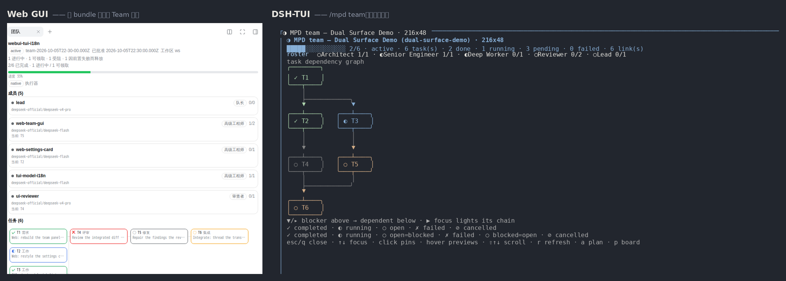
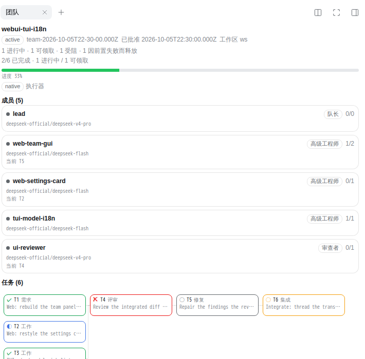
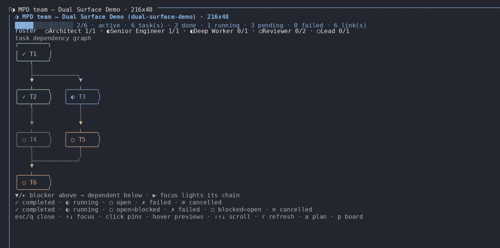
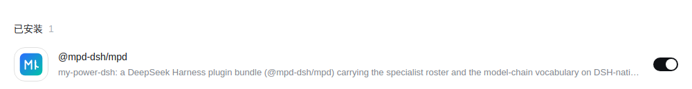
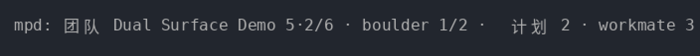
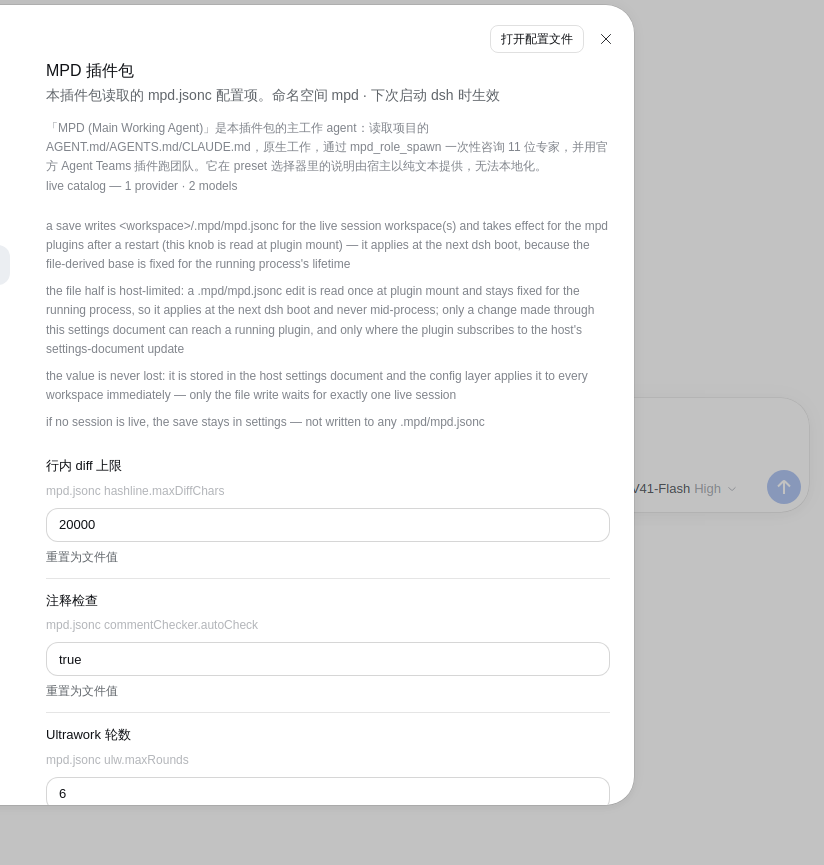
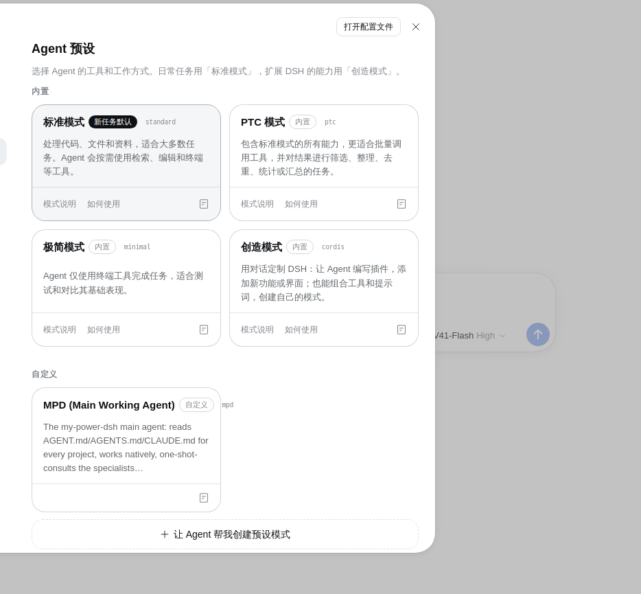
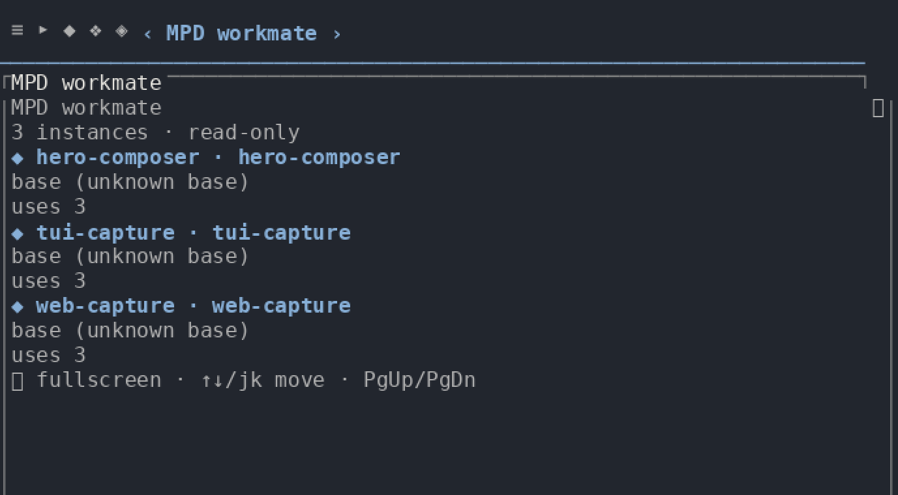

# my-power-dsh

[English](./README.md) | **中文**

[](https://github.com/HaroldZ32/My-Power-Dsh/releases)
[](https://www.npmjs.com/package/@mpd-dsh/mpd)
[](./LICENSE.md)
[](#致谢)
[](#一个插件两个端)
[](https://bun.sh)
[](https://github.com/HaroldZ32/My-Power-Dsh/actions/workflows/gates.yml)
[](./docs/index.zh-CN.md)

**my-power-dsh** 是 [DeepSeek Harness](https://github.com/deepseek-ai/deepseek-harness)（DSH）的一个插件
套件。一条安装命令，就把一套普通的 DSH 变成真正能干活的工作环境：一个会读你项目规则的主智能体、
十一位可咨询可委派的专家、一个会记住自己学过什么的持久 workmate 库、跑在 harness 官方 Agent Teams 插件
上的多智能体团队、一份按需加载的技能库、用于代码理解的 MCP 服务，以及一套让别的包也能贡献能力的扩展接口。

**同一个产品，两个端。** 下面写的每一项都同时存在于 **DSH Web GUI** 和 **DSH-TUI** 终端版里——
同一份安装、同一个 `.mpd/` 状态、同一套工具、同一个 `mpd` preset。没有任何东西被分叉；一个能力也不会
仅仅因为在终端里没有像素就不存在。

套件本体是包 [`@mpd-dsh/mpd`](https://www.npmjs.com/package/@mpd-dsh/mpd)；**本仓库的根目录就是这个包**。
一条命令装好，一条命令卸干净，不留残留。



*同一个套件、同一次运行、同一份状态——左边是 **Web GUI**，右边是 **DSH-TUI** 终端版。本页所有截图都是
对已发布套件的真实抓取，由 [`docker/ui/`](./docker/ui/) 下的 Docker 实机通道产出：Web 图由无头
Chromium 驱动真实应用截取；终端图把**真实 TUI 在真实 PTY 上发出的字节流**（`tmux capture-pane -e`，
带着 TUI 自己的颜色）按 tmux 算好的字符网格栅格化。有一件事图上看得出来，这里也写明：TUI 会本地化
命令描述与状态行，但**不会**本地化场景正文，所以两个语言下的终端场景图看起来是一样的——真正不同的
只有状态行和简体中文的 Web 图。*

## 一个插件，两个端

一条安装命令可以把套件装进任意一个 profile——也可以两个都装——两个端共享同一个状态根
（`<workspace>/.mpd/`）、同一套工具和同一个 `mpd` preset。差别只在**渲染方式**。

| 你想做的事情 | DSH Web GUI | DSH-TUI（终端） | 对齐情况 |
|---|---|---|---|
| 看团队：id、名称、阶段、状态 | 侧边栏里的 **Team** 视图，由本 bundle 自己提供（`/plugins/mpd-team/state`） | `/mpd team`——一整屏场景 | 事实相同 |
| 看名册：成员、模型路由、每人任务数 | Team 视图里的成员卡片 | `/mpd team` 里的同一批行 | 事实相同 |
| 读任务图——id、类型、状态、归属、attempt、round、依赖 | Team 视图的依赖图；悬停点亮依赖链，点击钉住节点 | 同一批数据，画成方框和制表符连边 | 事实相同 |
| 看一波已经安静下来的工作 | **Team watchdog** 侧边栏页签：hold、升级横幅与事件回放 | `team-hold held (…)` 行 + 事件回放对话框 | 事实相同 |
| 开工前审阅一份待批计划 | Team 视图会渲染出待批计划，以及批准它要输入的那句话 | `/mpd plan`——读完输入 `approve plan-…`，然后 `Ctrl+X` | 同一份计划；两个端批准都是发一次 `agent_teams_plan` 工具调用 |
| 浏览 workmate 库 | **Workmates** 侧边栏页签：列表、persona / memory / note | `/mpd workmates`——只有列表 | TUI **只有列表**；增删改是 Web 独有 |
| 调套件的各种旋钮 | 设置 → **MPD** 分区 | `/settings` → MPD 分区 | 同一批旋钮，同样的重启前提 |
| 一边打字一边看计划 / boulder / workmate 进度 | 侧边栏和设置卡片 | 提示符上方的**按键状态行** | TUI 原生界面 |
| 全程不碰鼠标 | ——（指针，外加下面那个面板） | **状态行**、`/mpd` 命令树、`alt+a` 合并面板 | TUI 原生界面 |
| 看 *harness* 自己带的名册与任务板 | 对话头部的 **Agent Teams** 面板 —— 一个**不同且只读**的界面（它不 spawn、不改名、不删除任何东西） | —— | 不是本 bundle 的界面 |
| 查看已归档的团队 | Agent Teams 面板上的 `?archived=1` | 不投影——TUI 只读最新的活跃记录 | Web 独有 |
| 拖动和缩放面板 | Agent Teams 面板是个浮动面板 | 终端场景没有几何概念 | 不适用 |

有两个 Web 界面很容易混淆，所以上表把它们分开点名：对话头部的 **Agent Teams** 面板属于 harness 自己的
客户端，是只读的；而 **Team** 与 **Team watchdog** 是本 bundle 自己的页面，由它自己的路由提供，渲染在
当前组合所提供的那个侧边栏宿主里。

**这里的"对齐"是量出来的，不是声称的。** 这张表背后的逐行台账是
[`docs/tui-parity.md`](./docs/tui-parity.md)，每一行都写明了证据，每一条仍然开放的偏差都记录在案。
上表中两列不是同一句话的那些行，正是台账里记下的偏差。在拿 TUI 顶替一项 Web 能力之前，请先读那份台账。





## 特性

- **会读你规则的主智能体**——套件唯一发布的 preset `mpd` 带着项目指令约定：每个会话都会从项目根一路到
  当前目录尝试 `AGENT.md`、`AGENTS.md`，再退到 `CLAUDE.md`。
- **十一位专家，可咨询也可委派**——Architect、Researcher、Planner、Deep Worker、Senior Engineer、
  Lead、Explorer、Reviewer、Plan Reviewer、Vision Analyst、Junior Engineer。每位都是带自己模型路由的
  队友模板，只读的那些是被**机械地**禁用写入工具，而不是靠自觉。
- **会积累的 workmate 库**——把一位专家实例化成 `~/.mpd/workmate/` 下的持久智能体；它每次干活后自我总结，
  演化自己的 persona 与记忆。
- **真正的多智能体团队**——跑在 harness 官方 Agent Teams 插件上，由 `mpd` 的各行驱动：`spawn_teammate`、
  带 compare-and-set 生命周期的共享任务板、持久信箱，以及一个 Web 面板和一个 TUI 场景同时读同一份活跃记录。
- **持久的计划台账**——ULW 轮次，每条验收标准走 PIN → RED → GREEN → SURFACE → CLEAN；锚定到计划文件的
  boulder 台账；以及能跨会话存活的持久 goal。
- **记忆与编辑都经得起时间**——VCS 托管的记忆库加一台反思状态机，外加哈希锚定编辑、写入守卫与声明注释关卡。
- **有牙齿的验证**——一个智能体写的代码由**另一个**智能体验证，依据是冻结的契约，留下判决与关卡证据。
- **代码理解与可扩展性**——AST 搜索（ast-grep）、代码知识图谱、language server、git-bash 四类 MCP 服务；
  外加一套扩展接口，让别的包贡献技能、流程、MCP 服务和专家。
- **双语是硬规定**——每一份面向人的文档都同时提供英文文件与简体中文孪生文件，任何一份落后，关卡就会红。

## 安装

需要 **Node.js ≥ 22.18** 与 `PATH` 上的 `pnpm`，以及一份带 `web` 或 `headless` profile 的 **DSH**。
套件从不替你配置模型密钥。

```bash
# Web GUI profile
dsh plugin --profile web add @mpd-dsh/mpd

# DSH-TUI profile —— 同一个套件，终端那个端
dsh plugin --profile dsh-tui add @mpd-dsh/mpd
```

然后重启 `dsh`，用 **MPD (Main Working Agent)** preset 开一个会话。卸载：

```bash
dsh plugin --profile web remove @mpd-dsh/mpd
```

这个包不声明 `cordis` 依赖，也没有 `preinstall`/`install`/`postinstall`/`prepare` 脚本，所以安装它不会执行
包里的任何代码。它所有的行都只通过 `cordis.patch.yml` 加 profile 机制进入 harness，而且**不覆盖任何 host
行**：`mpd` preset 是增量添加的，把它设成默认靠的是**你自己**的一次动作，永远不是套件替你做的。



想跟仓库而不是 npm 发布版，或者要钉住某个 revision，就从检出目录安装：

```bash
git clone https://github.com/HaroldZ32/My-Power-Dsh.git && cd My-Power-Dsh
bun install                                       # 先把声明的运行时依赖实体化
dsh plugin --profile web add .
```

完整的安装细节——打包产物、`dsh-tui` 启动器、依赖闭包，以及安装到底挂了什么——见
[使用者指南](./docs/user-guide.zh-CN.md#1-安装)。

## 快速上手

1. **装好**，重启 `dsh`，用 **MPD (Main Working Agent)** preset 开一个会话。
2. **让它干点真活。** 它手里有 `bash` / `read` / `edit` 和几个 MCP 代码工具。在项目里放一个 `AGENT.md`
   就能指挥它——会话启动时会自动读。
3. **咨询一位专家。** `mpd_roles_list` 列出名册，然后
   `mpd_role_spawn { role: "Architect", task: "review the module boundaries in src/" }`。
4. **把好用的留下来。** `mpd_workmate_init { base: "Architect", name: "system-architect" }`，之后用
   `mpd_workmate_spawn { name: "system-architect", task: "…" }` 复用。
5. **升级成团队。** 直接要一个，或者把一件确实值得组队的事说清楚：captain 会用 `spawn_teammate`
   生成每位成员、用 `team_task_create` 开出它的通道，再用 `send_message` / `wait_agent` 驱动它。
   在 Web 面板的 **Agent Teams** 视图里，或者 TUI 的 `/mpd team` 场景里看名册和共享任务板。
6. **教它一项新能力。** 把扩展目录放进 `<workspace>/.mpd/extensions/`，用 `mpd_ext_list` 检查。

第一分钟就值得知道的两条命令：

```text
/ulw  <目标>          把长目标按轮次推到完工，带关卡
/mpd  team            打开团队场景（DSH-TUI）
```

或者直接开口问。想要一双受约束的第二双眼时，点名一位专家：

```text
让 Architect 审一下 src/queue.ts 里的重试逻辑
```



状态行、`/mpd` 命令树和 `/settings` 分区是终端原生界面；它们在 Web 那边对应的是 Agent Teams 面板、
Workmates 页签和设置里的 MPD 分区。

## 用法

套件的活儿都通过工具和命令发生——两个端用的是同一批。速查：

| 你想…… | 用什么 | 细节 |
|---|---|---|
| 用会读项目规则的智能体干活 | **`mpd` preset** | [使用者指南 §2](./docs/user-guide.zh-CN.md#2-mpd-preset) |
| 要一个受约束的第二意见 | **专家名册** —— `mpd_role_spawn` | [使用者指南 §4](./docs/user-guide.zh-CN.md#4-专家名册) |
| 让一位专家积累知识 | **workmate 库** —— `mpd_workmate_*` | [使用者指南 §5](./docs/user-guide.zh-CN.md#5-workmate-库持久会演化的专家) |
| 跑真正的多智能体流程 | **团队模式** —— `spawn_teammate` + `team_task_*` | [使用者指南 §6](./docs/user-guide.zh-CN.md#6-团队模式) |
| 把长目标推到完工 | **ULW 循环** —— `/ulw` | [使用者指南 §13.2](./docs/user-guide.zh-CN.md#132-ulw-循环与它的关卡) |
| 持久跟踪多步计划 | **boulder 台账** —— `mpd_boulder_*` | [使用者指南 §13.6](./docs/user-guide.zh-CN.md#136-boulder-台账) |
| 跨会话记住事实 | **记忆引擎** —— `mpd_memory_*` | [使用者指南 §13.7](./docs/user-guide.zh-CN.md#137-记忆) |
| 编辑文件不因行号漂移出错 | **哈希锚定编辑** —— `mpd_hashline_*` | [使用者指南 §13.5](./docs/user-guide.zh-CN.md#135-哈希锚定编辑) |
| 理解一个陌生的代码库 | **MCP 服务** —— ast-grep、LSP、CodeGraph | [使用者指南 §3](./docs/user-guide.zh-CN.md#3-按用途划分的工具) |
| 教套件一个新花样 | **扩展接口** —— `mpd_ext_*` | [使用者指南 §10](./docs/user-guide.zh-CN.md#10-从使用者视角看扩展) |
| 全部在终端里驱动 | **DSH-TUI 版** | [使用者指南 §7](./docs/user-guide.zh-CN.md#7-dsh-tui-版本终端界面) |





配置是 JSONC 且分层：`<workspace>/.mpd/mpd.jsonc` 覆盖 `$DSH_HOME/mpd.jsonc`，按**单个键**覆盖，项目文件赢。
你的状态住在 `<workspace>/.mpd/`；唯一的例外是 workmate 库，它在 HOME 下：`~/.mpd/workmate/`。见
[使用者指南 §9](./docs/user-guide.zh-CN.md#9-配置mpdjsonc) 和
[§14](./docs/user-guide.zh-CN.md#14-这些能力的来源)。



## 状态与已知限制

- **针对一个预发布版 harness 构建和验证。** 套件按 **0.2.0-rc.2** 测试。上游稳定之前请预期会有破坏，
  并钉住你使用的 harness 版本。
- **TUI 端在若干**指名道姓**的地方落后于 Web 端，但不是处处都落后。** 上表中两列不读作"事实相同"的那些行，
  都是仍然开放的偏差，每一条的证据都记在 [`docs/tui-parity.md`](./docs/tui-parity.md)。那里没有惊喜，
  也没有东西被悄悄藏起来。
- **套件是一个包，不是一份 fork。** 它不附带任何 harness 改动，也不编辑 DSH 源码；若 harness 改了某个 seam
  的名字，套件在一个适配器文件里吸收掉。
- **preset 默认值归你自己选。** 因为套件不覆盖任何 host 行，`mpd` preset 只会通过你自己的动作变成默认值——
  见 [docs/preset-default.md](./docs/preset-default.md)。
- **保存的设置要重启才生效。** 各插件是在挂载时读取配置的，所以 `mpd_config_get` 读出新值**并不**等于
  正在运行的插件已经在按它行事。
- **截图是无头抓取。** Web 图是固定视口下的 Chromium，由 Playwright 驱动；终端图是 TUI 自己发出的
  字节流（带 ANSI，从真实 PTY 抓取），按 tmux 算好的字符网格栅格化——真实的输出，某一个渲染器的
  像素。换个浏览器窗口尺寸或换一个终端，排版就会不同：**成立的是屏幕上那些事实**，不是像素。
- **许可证：源码可见，但非开源。** SUL-1.0 允许内部与个人使用、以及免费的非商业分发；它不是 OSI 许可证。

## 文档

- **[使用者指南](./docs/user-guide.zh-CN.md)** —— 安装、按用途划分的工具、团队、配方、命令参考。
- **[文档中心](./docs/index.zh-CN.md)** —— 全部文档，并为使用者、扩展作者、贡献者和智能体分别给出阅读路径。
- **[DSH-TUI 版](./docs/tui.zh-CN.md)** —— 准入、分发与逐包兼容性。
- **[TUI 对齐台账](./docs/tui-parity.zh-CN.md)** —— Web 端与 TUI 端逐行对照。
- **[设计](./docs/design.zh-CN.md)** —— 套件内部是怎么拼起来的。
- **[扩展](./docs/extensions.zh-CN.md)** 与
  **[扩展编写指南](./docs/extension-authoring-guide.zh-CN.md)**。
- **[贡献](./CONTRIBUTING.zh-CN.md)** —— 环境搭建、关卡与 git 模型。

## 贡献

[`CONTRIBUTING.zh-CN.md`](./CONTRIBUTING.zh-CN.md) 写着环境搭建、构建与关卡命令，以及分支模型。本仓库靠
一套关卡而不是靠评审习惯来开发：**没有落在磁盘上的证据，就不算做完**。面向人的文档和 Pull Request 描述都是
双语的（英文 + 简体中文）。

## 变更日志

发布说明在 [`CHANGELOG.md`](./CHANGELOG.md)，最新的在前，每个已发布版本一节（当前版本是 **v0.12.0**）。
带注释的 tag 列在 [Releases](https://github.com/HaroldZ32/My-Power-Dsh/releases)。

## 致谢

专家名册、模型链词汇以及名册的稳定 id 改编自
[`code-yeongyu/oh-my-openagent`](https://github.com/code-yeongyu/oh-my-openagent)（v5.0.0-beta.20），
作为历史来源记录在 [`VENDOR_LOCK.json`](./VENDOR_LOCK.json)。那个上游是一份**参考，不是依赖**：本仓库没有
任何东西读它、抄它、打补丁或审计它，它挂掉也不会让任何一个关卡变红。

套件组合的是 harness 自己的官方包而不是把它们 fork 出来，并且为了 Workmates 页签挂了社区侧边栏包
`dsh-better-sidebar`。署名与第三方声明在 [`LICENSE-NOTICES.md`](./LICENSE-NOTICES.md)。

## 许可证

**SUL-1.0** —— 见 [`LICENSE.md`](./LICENSE.md)。允许内部与个人使用；分发免费且仅限非商业。
